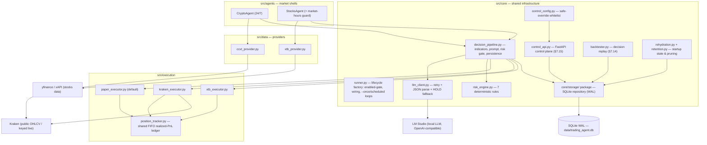
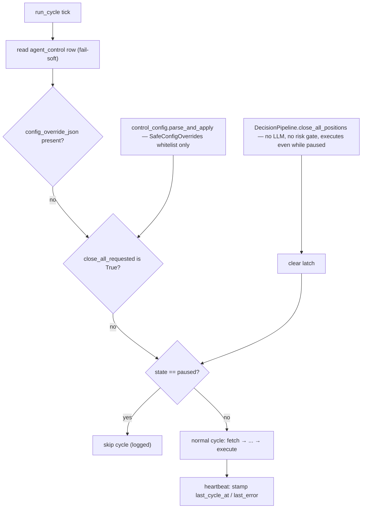
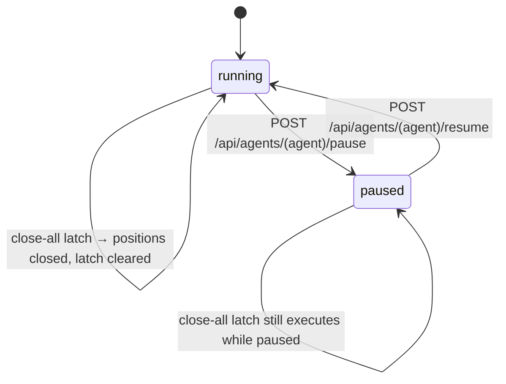
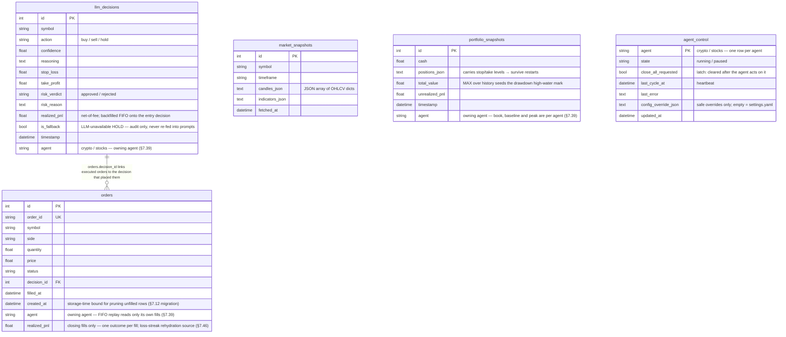
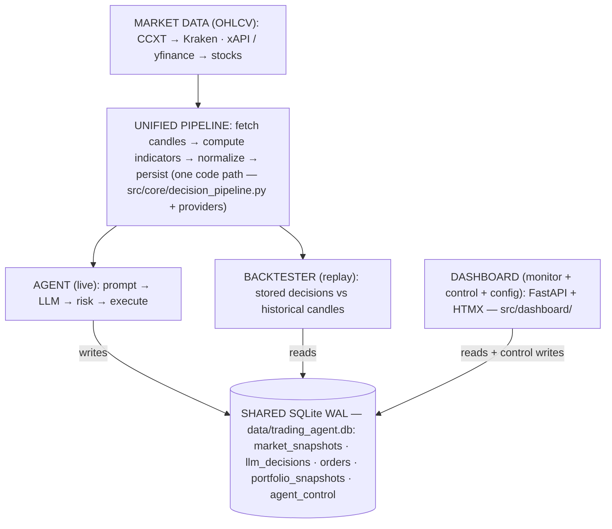

# Autonomous Trading Agent — Architecture

This document describes **how the system is built**: module layout, data flow, storage schema, the control plane, risk engine, and the design decisions behind them. Diagrams are Mermaid; verbatim contracts are marked as such.

**Document map**

- [README.md](README.md) — user-facing overview & quickstart (canonical file-level project layout)
- **ARCHITECTURE.md** (this file) — architecture: components, data flow, schema, control plane, design decisions
- [HISTORY.md](HISTORY.md) — what has been delivered (status snapshot, original Phase 1–2 plans, completed §7 items)
- [PLAN.md](PLAN.md) — gaps, todos & next steps (§7 lives there; §7.N identifiers are never renumbered)
- `AGENTS.md` — agent-facing facts & rules injected into coding-agent prompts
- `nightly_finds.md` — bugs/gaps discovered during development (numbered findings)
- `review.MD` / `review2.md` — external full-codebase reviews (`[R-xx]` tags reference these)

## Overview

Two independent paper-trading agents sharing a common core:

| | Crypto Agent | Stocks Agent |
|---|---|---|
| **Exchange** | Kraken (public data; keyed = sandbox or ack-gated live, §7.41) | XTB (demo account) |
| **Data** | CCXT (OHLCV); news/sentiment — *planned* | xAPI + yfinance (OHLCV); economic calendar — *planned* |
| **LLM** | LM Studio → Qwen 3.8 27B (`qwen/qwen3.8-27b`) | Same shared LLM client |

Both agents use the same decision pipeline, risk engine, and storage layer — only the data sources and execution adapters differ.

## System context



- **Layering**: `agents/` are thin market-specific subclasses of `BaseTradingAgent`; all shared lifecycle lives in `core/runner.py::run_agent` + `agents/base_agent.py` (§7.13). Market quirks hook via `_skip_cycle_reason()`.
- **One runner process per agent** (§7.52): `run_agent` holds an exclusive non-blocking `flock` (`<db-dir>/<component>.runner.lock`, acquired before anything is constructed; contention → `RunnerAlreadyRunning`, exit 2). Kernel-released on abrupt death, so two runners can never trade one DB from separate in-memory books.
- **Protocol seams**: providers and executors are swappable via `Protocol` interfaces (`Executor` is defined in `core/models.py`). Paper is the default executor on both markets.
- The backtester and control API read/write the *same* SQLite DB — no separate state anywhere.

## Module layout (current)

```
src/
├── core/
│   ├── models.py             # Pydantic models + Executor Protocol (single source of truth for contracts)
│   ├── config.py             # YAML + env settings loader (Settings validates config/settings.yaml)
│   ├── llm_client.py         # LM Studio HTTP client (retry, JSON parse, HOLD fallback, llm_exchange audit log)
│   ├── risk_engine.py        # 7 deterministic risk rules (all live) + trackers (daily loss, cooldown, drawdown HWM)
│   ├── storage/              # SQLite via SQLAlchemy + aiosqlite (WAL) — package (§7.36):
│   │                         # models/engine/snapshots/decisions/orders/control/pruning mixins,
│   │                         # Storage facade composed in storage.py, re-exported from __init__
│   ├── decision_pipeline.py  # fetch → mark positions → exit-level check → indicators → prompt → LLM → risk gate → execute → persist
│   │                         # + shared rule functions: exit_level_breach(), calculate_quantity() (§7.14 extraction)
│   ├── rehydration.py        # startup pass: paper book, daily-loss baseline, streak/cooldown from persisted rows (§7.7)
│   ├── retention.py          # fail-soft storage pruning wrapper (startup + scheduled) (§7.12)
│   ├── runner.py             # shared runner lifecycle: enabled-gate, single-instance flock (§7.52), wiring, control API startup, --once/scheduled loops (§7.13)
│   ├── backtester.py         # DecisionReplayBacktester — same risk/fee model over stored decisions, zero LLM calls (§7.14)
│   ├── control_api.py        # agent-side FastAPI control API (pause/resume/close-all/config/status) (§7.15 P2)
│   ├── control_config.py     # SafeConfigOverrides whitelist; parse_and_apply onto live objects (§7.15 P2)
│   └── scheduler.py          # APScheduler wrapper
├── data/
│   ├── ccxt_provider.py      # Crypto OHLCV via CCXT (fetch_snapshot + paginated fetch_history)
│   └── xtb_provider.py       # Stocks OHLCV (yfinance source; xAPI is the seam) + fetch_history
├── execution/
│   ├── paper_executor.py     # simulated executor (default): fees, slippage, net PnL, update_price marking hook, load_portfolio_state
│   ├── position_tracker.py   # shared FIFO cost-basis ledger → realized_pnl + closed_entries per entry decision (§7.8)
│   ├── kraken_executor.py    # Keyed Kraken orders via ccxt — sandbox if the exchange has one, else ack-gated live (§7.41); real payload parsing, spot fetch_positions degradation handled;
│   │                         # pending orders re-polled each cycle — reconcile_open_orders, §7.28;
│   │                         #  resolved statuses re-delivered until confirm_reconciled, §7.44)
│   ├── xtb_executor.py       # XTB demo orders via the injected XTBClient seam
│   └── xtb_client.py         # real xAPI WebSocket client (§7.16): ws.xapi.pro, login auth, instant orders, tick marks
├── agents/
│   ├── base_agent.py         # BaseTradingAgent: cycle loop, control-row handling, post-process, snapshots, alerts (§7.13)
│   ├── crypto_agent.py       # thin subclass
│   └── stocks_agent.py       # thin subclass + weekend/holiday/timezone-aware market-hours guard (§7.10)
├── analysis/                 # feature engineering + prompt building (§7.17, extracted from core)
│   ├── indicators.py         # compute_indicators + RSI/MACD/Bollinger/ATR helpers (pure)
│   └── prompt_builder.py     # build_user_prompt + DEFAULT_SYSTEM_PROMPT
└── monitoring/
    ├── logger.py             # structlog setup
    └── alerts.py             # AlertManager + sinks (logging sink; dedup window)

scripts/
├── run_crypto_agent.py       # crypto-specific factories + shared runner
├── run_stocks_agent.py       # stocks-specific factories + shared runner
├── prune_storage.py          # out-of-band retention pruning (no agents, no trades) (§7.12)
└── backtest.py               # decision-replay CLI (--start/--end/--days/--symbols/--provider/--timeframe/--report) (§7.14)

docs/API_NOTES.md             # Kraken + XTB API quirks
config/settings.yaml          # all tunables (see §Configuration below)
```

## Decision pipeline — one cycle

```mermaid
sequenceDiagram
    autonumber
    participant SCH as Scheduler / --once
    participant AG as BaseTradingAgent
    participant CTL as agent_control row
    participant PL as DecisionPipeline
    participant PR as Data provider
    participant EX as Executor (paper/venue)
    participant LLM as LLM client
    participant RE as RiskEngine
    participant ST as Storage

    SCH->>AG: run_cycle()
    AG->>CTL: read control row (fail-soft, strict checks)
    Note over AG: apply safe config overrides if present
    alt close_all_requested is True
        AG->>PL: close_all_positions() — even while paused
        Note over PL: no LLM call, no risk gate — exits only reduce exposure
    end
    alt state == paused
        AG-->>SCH: skip cycle (logged)
    end
    AG->>PL: run(symbol) per pair/symbol
    PL->>PR: fetch snapshot (OHLCV candles)
    PL->>EX: update_price(symbol, last close) — marking hook (paper only)
    Note over PL: exit-level check: breach → auto-close full quantity (no LLM, no gate), cycle ends with auto_exit=True
    Note over PL: bar timing (§7.56): split off the forming bar; if decide_on_new_bar_only and the latest closed bar is already decided → end cycle (skip_reason), no LLM call
    PL->>PL: compute indicators on closed bars only (RSI, MACD, Bollinger, ATR — hand-rolled, simple averages)
    PL->>EX: read book once (positions + cash) — reused unchanged at the gate
    PL->>LLM: prompt = market data + YOUR BOOK (symbol position, cash, limit headroom) + last-N decisions with honest outcomes
    LLM-->>PL: TradeSignal JSON (exhausted-retries HOLD flagged is_fallback, never forgeable)
    PL->>ST: persist decision immediately after risk gate (decision_id exists before any fill)
    PL->>RE: evaluate(signal, portfolio, planned_notional = quantity × price)
    alt approved
        PL->>EX: place_order(quantity, stop_loss/take_profit levels, decision_id)
        EX-->>PL: OrderResult (+ realized_pnl / closed_entries on closing fills via PositionTracker)
        PL->>ST: persist order row (linked to decision_id)
        AG->>ST: backfill realized PnL onto the originating entry decision (FIFO attribution)
    else rejected
        PL->>ST: decision persisted with verdict + reason; nothing sent to venue
    end
    AG->>CTL: heartbeat — stamp last_cycle_at / last_error
```

Notes:

- **Marking before gating** (§7.1): paper positions are re-marked at the snapshot's last close *before* the risk check, so unrealized PnL, portfolio snapshots and the daily-loss rule track the market. Real-venue executors report live prices and skip the hook.
- **Bars, not cycles, drive decisions** (§7.56): candle timestamps are bar open times; `analysis/candles.py` splits off the still-forming bar — indicators use closed bars, the forming bar stays the live price (marking, exits, prompt "Current price … (live)") and is labelled `[FORMING]` in the prompt. With `decide_on_new_bar_only` the LLM is asked once per newly closed bar per symbol (last decision time in memory, from storage after a restart; fallback HOLDs don't count) while every cycle still marks and enforces exits.
- **The model sees its own book** (§7.45): the prompt's *YOUR BOOK* section carries the symbol's long position (size, entry, mark, uPnL, active SL/TP), cash vs equity and the per-symbol limit with remaining headroom; past-decision outcomes read `n/a` for HOLD/rejected/unfilled decisions and `still open` only for executed, unclosed entries (`DecisionRecord.filled` ← `Storage.get_filled_decision_ids`).
- **Sizing before gating** (§7.5): `calculate_quantity()` runs first and its notional is passed into `evaluate()`; the approved plan is reused unchanged at execution — a sizing regression cannot slip past approval. A SELL closes the whole held long (§7.47).
- **Persistence after a fill is fail-soft and lossless** (§7.44): the agent contains post-processing per symbol, retries order-row writes (audit log line + alert as last resort), and confirms reconciled venue transitions to the executor only after they are stored — so a locked/full DB never aborts a cycle, skips the heartbeat or loses a fill.
- **Closes are side-aware** (§7.48): close-all and exit enforcement send `closing_side(position)` — SELL for a long, a covering BUY for a short — and `exit_level_breach` mirrors the levels for shorts; every position in the symbol is checked (venues can hold a hedged pair).
- **Exit levels bypass the gate deliberately** (§7.9): cooldown/daily-loss blocks must never strand a position. Levels ride on `Position` (persisted in portfolio snapshots → survive restarts). These are *local* checks, not venue-side stop orders.
- Indicators and prompt building live in `src/analysis/` (`indicators.py`, `prompt_builder.py`), extracted verbatim from `core/decision_pipeline.py` (§7.17); the pipeline now only orchestrates data → indicators → prompt → LLM → risk → execution.

## Key models (`src/core/models.py`)

| Model | Role |
|---|---|
| `TradeSignal` | LLM output: action, confidence, reasoning, stop_loss, take_profit; `is_fallback` stripped from model output — never forgeable |
| `DecisionRecord` | prior decision + realized PnL outcome, fed back into the prompt ("learn from its own track record") |
| `RiskResult` | deterministic verdict: approved / rejected + reason |
| `Position` / `PortfolioState` | portfolio tracking; positions carry entry signal's stop/take levels |
| `MarketSnapshot` | OHLCV candles + computed indicators per symbol |
| `OrderResult` | order outcome; closing fills carry `realized_pnl` + `closed_entries` (per-entry-decision PnL) |
| `Executor` | Protocol — the seam between pipeline and venue |

## Executor protocol

All executors implement the same `Executor` Protocol (defined in `src/core/models.py`); `place_order` additionally accepts `decision_id` (§7.8) and `stop_loss`/`take_profit` levels (§7.9), and optional hooks (`update_price`, `load_portfolio_state`) are duck-typed:

All executors implement the same `Executor` Protocol (defined in `src/core/models.py`):

```python
class Executor(Protocol):
    async def place_order(
        self,
        symbol: str,
        side: OrderSide,
        quantity: float,
        price: float | None = None,
    ) -> OrderResult: ...
    async def get_positions(self) -> list[Position]: ...
    async def cancel_order(self, order_id: str) -> bool: ...
    async def get_cash(self) -> float: ...
```

- `kraken_executor.py` — keyed Kraken via ccxt (mode `<exchange>-sandbox` where ccxt has one; `<exchange>-LIVE` only with `live_trading: true` + `LIVE_TRADING_ACK`, §7.41); real `fetch_free_balance` / fill payload parsing; Kraken-spot `fetch_positions` rejection handled (warn once, return `[]`).
- `xtb_executor.py` — xAPI demo trading, now over the **real client** `execution/xtb_client.py::XApiClient` (§7.16). **Reduce first, never flip (§7.40):** an order opposite to open trades closes them FIFO via `close_trade` (`type=CLOSE` + the trade's `order` number); a SELL with nothing to close is refused (long-only; `allow_short` opt-in). Transport: WebSocket transactions to `wss://ws.xapi.pro/{demo,real}`, classic `login` auth (account id + xAPI verification code — *not* OAuth2; that endpoint does not exist), instant orders + status polling, live position marks via `getTickPrices`. Opt-in only (`xtb_execution.enabled` + env credentials); paper stays default.
- `paper_executor.py` — Pure simulation. No network calls. Tracks virtual portfolio state; per-side fees + slippage; net-of-fee `realized_pnl`. **Default for all testing.**

## Risk engine (`core/risk_engine.py`)

Hard-coded, non-negotiable gates in `risk_engine.py` (built Week 2 ✅). `RiskEngine.evaluate()` runs all of these, in order, on every **entry** (BUY). A SELL closes a held long and only reduces exposure, so it is checked for confidence alone — daily loss, drawdown, cooldown and size never strand a position — and a SELL with no long position is rejected (§7.47):

| Rule | Default | Configurable | Implementation |
|---|---|---|---|
| Min confidence | `0.6` to trade | Yes | `_check_confidence` |
| Max open positions | 5 per agent | Yes | `_check_max_positions` |
| Max position size | 10% of portfolio per symbol — existing long exposure + planned BUY (§7.42) | Yes | `_check_position_size` |
| Daily loss limit | -2% of starting balance | Yes | `_check_daily_loss` |
| Max drawdown | -5% below the **peak-equity** high-water mark (seeded from persisted portfolio snapshots) | Yes | `_check_drawdown` ✅ (§7.5) |
| Consecutive-losses cooldown | 3 losses → 60-min pause | Yes | `_check_cooldown` |
| Stop-loss required | Entries (BUY) must include a stop-loss; closes are exempt since §7.9 | No | `_check_stop_loss` |

> The earlier "-5% drawdown → halt for 24h" phrasing is not how the code behaves: there is no time-based halt. The 24-hour-scale protection is the **consecutive-losses cooldown** (3 losses → 60 min; both the streak and the pause are configurable via `consecutive_losses_threshold` / `consecutive_losses_cooldown_minutes`, §7.19).

Additional engine facts:

- The drawdown high-water mark is seeded at startup from `Storage.get_max_portfolio_value()` (`seed_peak_equity`, fail-soft), so it survives restarts (§7.5).
- Daily-loss baseline and losing-streak/cooldown are rehydrated from persisted rows by `core/rehydration.py` (§7.7).
- The size cap is per **position** (§7.42): `long_exposure(portfolio, symbol)` is added to a BUY's planned notional at the gate, and `calculate_quantity` sizes BUYs to the remaining headroom — repeated entries cannot pyramid past the cap.
- Sizing + exit-level rules are *shared functions* (`calculate_quantity`, `exit_level_breach` in `decision_pipeline.py`) so live, paper and replay can never drift (§7.14).

## Control plane (§7.15 P1/P2 — implemented)

The DB is the control source of truth: one `agent_control` row per agent. The agent-side FastAPI control API writes latches; the agent obeys them at the top of every cycle.



All checks are strict (`is True` / equality) and the control-row read is fail-soft — **a broken control plane never halts trading nor fabricates actions.**



### Control API (implemented)

`core/control_api.py::create_control_app(storage, agent_name, settings, get_positions)` — started in-process by `core/runner.py` only when `control_api.enabled` (default **false**); loopback-bound; ports crypto 8101 / stocks 8102.

| Method & path | Effect |
|---|---|
| `GET /healthz` | liveness |
| `GET /api/agents` / `GET /api/agents/{agent}` | state, positions, portfolio, recent decisions, errors |
| `GET /api/agents/{agent}/decisions?limit=N` | recent decisions + outcomes (fallback rows included — audit view) |
| `GET /api/agents/{agent}/portfolio?limit=N` | current + historical portfolio value |
| `POST /api/agents/{agent}/pause` / `resume` | write `state` in `agent_control` (never orders) |
| `POST /api/agents/{agent}/close-all` | set `close_all_requested` latch — executed on next cycle tick, even while paused |
| `GET /api/config` | safe config view: YAML defaults + stored overrides (whitelisted fields only) |
| `PUT /api/config` | body must validate as `SafeConfigOverrides` (`extra="forbid"`); unknown/credential keys rejected wholesale with 400 |

**Safety invariants:** credentials are *structurally absent* from every endpoint — responses are field-built from safe models; the LLM endpoint/model, storage path and any `.env` secret can neither appear in a response nor be written. `SafeConfigOverrides` (`core/control_config.py`) covers: `interval_minutes` (applies immediately — stored overrides are applied *before* scheduling at startup, and a live change re-arms the APScheduler job via `AsyncSchedulerManager.reschedule_cycle`, §7.50), `pairs`, `symbols`, `market_hours` (read per cycle by `StocksAgent` from the live settings object — single reader, §7.50), `decision_history_limit`, `risk.*` (**tighten-only** vs the YAML limits in `Settings.risk_baseline`, checked at write and apply time; `enforce_exit_levels` excluded — §7.43), paper-executor fee/slippage under `execution.*`. Every apply resolves each field as *YAML baseline + override* (`Settings.agent_baselines` / `risk_baseline` / `execution_baseline`), so removing an override reverts the live objects; saves persist only fields differing from YAML (`strip_noop_overrides`), and the agent re-applies on override **transitions** including → cleared (§7.50). Both web apps run behind `core/web_security.py` guards (§7.43): `TrustedHostMiddleware` (Host allowlist: loopback + bind host + `allowed_hosts` — blocks DNS rebinding, reads included) and `OriginGuardMiddleware` (writes with a foreign `Origin`/`Referer` → 403); the dashboard also requires its per-process CSRF token on every write. It is deliberately *not* applied to live objects mid-flight beyond that whitelist; risk thresholds mutate the shared `RiskSettings`, paper fee/slippage land on the executor.

## Storage schema & retention

- **One SQLite database** at `config.storage.database_path` (`data/trading_agent.db`), run in **WAL mode** so the dashboard can read while the agent writes, with no lock contention on the shared volume.
- Trade tables: `market_snapshots`, `llm_decisions`, `orders`, `portfolio_snapshots`.
- **Agent scoping (§7.39):** both agents share the file, so `llm_decisions`, `orders` and `portfolio_snapshots` carry an indexed `agent` column (`crypto`/`stocks`). A runner's `Storage(path, agent=component)` stamps every write and filters every read of those tables on it — each agent has its own book, daily baseline, drawdown peak, loss streak, FIFO replay and prompt history. Unbound storage (dashboard, CLIs) reads across agents or narrows with an explicit `agent=`. Pre-§7.39 rows are backfilled once at migration (decisions/orders by symbol shape — `BASE/QUOTE` → crypto; snapshots by their positions, empty books → crypto). `market_snapshots` is a symbol-keyed candle cache and stays unscoped.
- **New table — `agent_control`** (control plane, dashboard read/write):

  | Column | Purpose |
  |---|---|
  | `agent` | `crypto` / `stocks` — one control row per agent |
  | `state` | `running` / `paused` (pause/resume) |
  | `close_all_requested` | boolean latch — agent closes all open positions then clears it |
  | `status` / `last_cycle_at` / `last_error` | live health for the dashboard |
  | `config_override_json` | **safe** config overrides (see #6); empty = use `settings.yaml` |

  The agent checks `agent_control` at the top of every cycle (cheap SQLite read) → respects pause + close-all. This keeps the DB the single source of truth even though the dashboard *triggers* actions via the control API.



Retention policy (§7.12, `core/retention.py` + `scripts/prune_storage.py`): market snapshots default to 30-day retention (re-creatable cache); decisions/orders kept forever unless `history_retention_days > 0`; **`portfolio_snapshots` are never pruned** — they seed the drawdown high-water mark. Pruning runs at runner startup and on `storage.prune_interval_minutes`, fail-soft.

Rehydration (§7.7): at startup, `core/rehydration.py` restores — from the runner's *own* agent-scoped rows (§7.39) — the paper book (latest portfolio snapshot via `load_portfolio_state`), the daily-loss baseline (today's earliest snapshot) and losing-streak/cooldown (trailing **closing fills** — `orders.realized_pnl`, one per closing fill like the live tracker, §7.46). `execution.initial_cash` only seeds a fresh (empty) portfolio.

## Data pipeline, storage & dashboard (Week-6 design)

This section holds the **design decisions** locked in Week 6 — the data pipeline / DB / control architecture that backtesting (§7.14, delivered), the dashboard (§7.15 — fully delivered through Docker packaging), and the live agent all share. It is the source of truth for *how data flows*.

### Design decisions (locked)

| # | Decision | Chosen |
|---|---|---|
| 1 | Backtest type | **(a) Decision replay** — re-simulate *stored* `llm_decisions` against the price path that followed. Deterministic, **zero LLM calls**. (LLM replay = non-deterministic + expensive on the local 27B model; deferred.) |
| 2 | Backtest price history | **Fresh historical candles** from the source (Kraken via CCXT / yfinance) for arbitrary date ranges — the agent does not run 24/7, so stored `market_snapshots` alone is too sparse. Stored snapshots are kept as a secondary/audit source. |
| 3 | Dashboard control scope | **Pause/resume** + **close all open positions** + **safe config management** (see #6). No manual order placement, no live risk-param override, no kill in v1. |
| 4 | Agent ↔ dashboard control channel | **Agent exposes a small HTTP control API (FastAPI); the dashboard calls it** — real-time control (e.g. "close all" is immediate, not gated on the 5-min cycle). |
| 5 | Dashboard stack | **FastAPI + Jinja2/HTMX** (server-rendered, HTMX for updates + control), lightweight chart lib (uPlot) via CDN for time-series. No Node/npm build step → one slim Docker image. |
| 6 | Config management | Dashboard edits **safe data only** — intervals, pairs/symbols, `risk.*`, `execution.*`, `monitoring.*`, `decision_history_limit`. **Never** `llm.*` credentials/endpoints, never API keys, never `.env`. |
| 7 | Database | **One SQLite (WAL mode) on a shared Docker volume.** Agent = primary writer; dashboard = reader + control writer; backtester = reader. Keeps the existing SQLAlchemy + aiosqlite stack. |
| 8 | Pipeline shape | **Single unified pipeline** (one code path: provider → indicators → store) feeding all three consumers (agent, dashboard, backtester). |

### Data flow — one path, three consumers



> The **live agent** and the **backtester** both read the *same* indicator logic and (for backtest) the same decision rows — so what you backtest is exactly what the pipeline produces. The backtester does **not** re-run the LLM; it re-simulates the recorded decisions.

### Control API contract (original design)

The agent process serves a small internal API (in-process with the loop, or a thin sidecar):

| Method & path | Effect |
|---|---|
| `GET /api/agents` | state, `last_cycle_at`, open positions, recent decisions, `last_error` (per agent) |
| `GET /api/agents/{agent}/decisions?limit=N` | recent decisions + outcomes (net PnL) |
| `GET /api/agents/{agent}/portfolio` | current + historical portfolio value |
| `POST /api/agents/{agent}/pause` | set `state=paused` |
| `POST /api/agents/{agent}/resume` | set `state=running` |
| `POST /api/agents/{agent}/close-all` | set `close_all_requested` latch (immediate on next loop tick) |
| `GET /api/config` | **safe** config (credentials/keys redacted) |
| `PUT /api/config` | validate against Pydantic `Settings`, persist safe overrides to `agent_control`, reload agent |

> **Safety:** `PUT /api/config` only accepts the safe whitelist (#6); unknown/credential keys are rejected. The LLM endpoint, model, and any `.env` secret are **never** read, written, or returned.

> As implemented in P2, this contract gained `GET /healthz`, a per-agent status route (`GET /api/agents/{agent}`), and the whitelist enforcement described in §Control plane above. The safety note stands unchanged.

### Dashboard (§7.15 P3/P4 — implemented)

Standalone app (`src/dashboard/app.py::create_dashboard_app`, launched by `scripts/run_dashboard.py` on `dashboard.host:port`, default loopback `127.0.0.1:8080`). Reads the shared SQLite DB (WAL) through `Storage` as a **reader** — no HTTP coupling to the agent process, so it works whether or not `control_api.enabled`.

- **Monitor:** overview page (portfolio cards + uPlot portfolio-value chart refreshed from `/api/portfolio.json`, recent decisions), positions page — all per agent via `?agent=` (default: first configured agent; books are never blended, §7.39) — decisions page (all agents with an Agent column, or `?agent=`-filtered) with win-rate / avg-confidence / confidence-histogram stats (`views.py::decision_stats`), health cards refreshed via HTMX polling of `/partials/health` every `dashboard.refresh_seconds`. The health badge shows an **effective status** (`views.py::agent_status`), not the raw latch: `disabled` → `paused` (latch) → `offline` when the heartbeat (`last_cycle_at`) is missing or older than 2× the agent's `interval_minutes` (floored at 10 min, +5 min grace) → else `running`. Agents stamp that heartbeat after every cycle *and* on market-hours skips (pause returns before it — its latch renders instead), so liveness never false-alarms in quiet windows.
- **Control:** Pause / Resume, Close all — HTMX `POST /control/{agent}/{action}` writes the `agent_control` latches **directly** (same repository methods as the agent-side control API); running agents honor them on their next cycle via `_handle_control`.
- **Log viewer:** `/logs/{agent}` tails `data/agent_<name>.out.log` (the captured output of dashboard-launched runners) — last ~64 KiB / 400 lines (`views.py::tail_lines`), HTMX-polled partial refresh, linked from health cards when a log exists. Read-only; path built only from the config agent whitelist next to the live DB (`storage.database_path`).
- **Launch (opt-in, §7.24):** when `dashboard.allow_launch` is true, health cards gain **Start**/**Stop (pid …)** buttons (`POST /launch/{agent}/{action}`). `src/dashboard/launch.py::AgentLauncher` spawns the same entry points you'd run by hand (`python -m scripts.run_<agent>_agent`) as local subprocesses — enabled-gates, risk rules and paper-by-default execution apply unchanged; child output appends to `data/agent_<name>.out.log`, pid goes to `data/<agent>.pid`. Children outlive the dashboard (killing the UI never halts trading); a restarted dashboard re-adopts old children only when the pidfile's pid is alive AND its `/proc` cmdline still matches the runner — foreign/recycled pids are never killed, and Stop only ever targets launched/adopted processes. Start refuses (409) on fresh heartbeats (no double-trading), disabled agents, or already-managed ones; 403 wholesale when supervision is off. Off under docker-compose (services belong to compose there).
- **Browser safety (§7.43):** Host allowlist + cross-origin write rejection (shared with the control API) and a per-process CSRF token embedded in every page (`<body hx-headers>` for HTMX, hidden `csrf_token` field in the config form) and required by every write route.
- **Config:** server-rendered form (`GET/POST /config/{agent}`) over the safe config surface only (risk limits tighten-only); the urlencoded body is parsed into the nested payload and validated server-side through `validate_overrides_payload` → `SafeConfigOverrides` (`extra="forbid"` — any unknown/credential-shaped key rejects wholesale, and the form re-renders with the rejection); accepted values persist to `agent_control.config_override_json` — only after `strip_noop_overrides` drops fields merely echoing the YAML baseline, so saving never pins defaults (§7.50). No credential/secret fields exist in the form.

### Container / volume topology (§7.15 P5 — implemented)

One slim image (`Dockerfile`: python:3.11-slim, non-root `appuser`; installs the package itself + `[stocks]` — dashboard templates ship as package-data via explicit setuptools discovery) serves all four services of `docker-compose.yml`:

```
docker compose up -d --build            # agents + dashboard; backtester: docker compose run --rm backtester --days 30
├── agent-crypto     # scripts/run_crypto_agent.py   (control API in-process if enabled)
├── agent-stocks     # scripts/run_stocks_agent.py
├── dashboard        # scripts/run_dashboard.py      (bound to loopback on the host: 127.0.0.1:8080; /healthz healthcheck)
└── backtester       # scripts/backtest.py           (`tools` profile — never started by `up`, restart: "no")
    volume: agent-data → /app/data      # named volume: the shared SQLite + WAL files
    bind:   ./config  → /app/config:ro  # read-only (see deviation note below)
```

- **One shared `agent-data` volume** holds the SQLite DB (agent writes, dashboard/backtester read). WAL mode permits concurrent read/write.
- **Deviation from the locked design:** `config/` is a **read-only bind mount**, not an `agent-config` named volume — nothing ever writes config files (safe overrides live in `agent_control` DB rows), so host edits stay authoritative on container restart instead of going stale inside a pre-seeded volume.
- Secrets enter only via compose environment substitution (`${KRAKEN_API_KEY:-}` etc. — empty keeps the paper executor); `.dockerignore` guarantees `.env` is never baked into an image. LM Studio on the host is reached via `host.docker.internal:host-gateway` (override with `LM_STUDIO_ENDPOINT`).
- No Postgres in v1; revisit only if multi-writer contention shows up (WAL + single primary writer should not).

## Backtesting (§7.14 — implemented)

Design (Week 6):

`scripts/backtest.py` — deterministic, no LLM:

1. **Ingest** fresh historical candles for the window (per #2) via the *same* providers — or read stored snapshots when they cover the window.
2. **Load** the recorded `llm_decisions` (+ `orders`, realized PnL) in time order.
3. **Re-simulate** each decision against the price path that followed, through the **same** risk engine + fee/slippage model as live, so the verdicts and PnL are comparable to paper results.
4. **Report:** total return vs. buy-and-hold benchmark, win rate, avg win/loss, max drawdown, Sharpe, per-symbol breakdown.

> **Why decision replay (not LLM replay):** it is deterministic, free, and tests the parts we control (risk engine, execution, fees) against real price paths. LLM replay (feeding history back to the model for *fresh* signals) is a separate, later experiment — non-deterministic and costly on the local 27B model.

Implementation status:

**No look-ahead (§7.49):** candle timestamps are bar open times, so each candle event fires at its **close** (open + timeframe); decisions are priced from bars that had closed when they were made, and exits fire when the breaching bar closes.

**Decision replay**: `DecisionReplayBacktester` (`src/core/backtester.py`) re-simulates the *stored* `llm_decisions` against **fresh historical candles** (Kraken via CCXT paginated `fetch_history` / yfinance range fetch) through the **same** risk engine + fee/slippage model as live — deterministic, **zero LLM calls**. Exit levels and position sizing are shared functions (`exit_level_breach` / `calculate_quantity`) so replay cannot drift from live. Stored `market_snapshots` remain a secondary/audit source.

Metrics (CLI summary + `--report` JSON):
- Total return vs. per-symbol buy-and-hold benchmark (+ equal-weight blend)
- Win rate, average win/loss
- Max drawdown, annualized Sharpe (coarse for stock gaps — documented)
- Auto-exit / risk-rejected / hold counts, per-symbol breakdown, equity curve

> LLM *replay* (feeding history to the model for fresh signals) is a separate, later experiment — non-deterministic and costly on the local 27B model. See the "Data pipeline, storage & dashboard (Week-6 design)" section above.

## Monitoring

- Structured logs for every decision (timestamp, symbol, signal, reasoning, risk verdict, execution result) ✅ `monitoring/logger.py` — console lines render as `[YYYY-MM-DD HH:MM:SS][level] message key=value …` (local wall clock; whitespace-bearing values quoted, tracebacks appended raw), so agent terminal output and `data/agent_*.out.log` stay grep-able
- Alert dispatch on trades, risk rejections, errors and **LLM outages** ✅ `monitoring/alerts.py` — structlog log sink always; `WebhookAlertSink` (JSON for Slack/Discord/generic or ntfy) when `ALERT_WEBHOOK_URL` is set (§7.51). A fallback HOLD is also the cycle's `last_error`, and the dashboard health card shows the recent LLM-fallback count.
- LLM audit trail ✅ — full `llm_exchange` structlog event (system prompt + user prompt + raw response) per live decision; fallback HOLDs flagged in `llm_decisions.is_fallback` and excluded from prompt context (§7.8)
- Web dashboard (FastAPI + Jinja2/HTMX, Docker) — monitoring **plus control** plus safe config management: agent-side control API ✅ (§7.15 P1/P2); dashboard pages + control/config UI ✅ (`src/dashboard/`, `scripts/run_dashboard.py` — §7.15 P3/P4); Docker/compose packaging ✅ (`Dockerfile` + `docker-compose.yml` — §7.15 P5)

## LM Studio Integration Details

**Endpoint:** `http://127.0.0.1:1234/v1/chat/completions` (OpenAI-compatible)

**Model:** Qwen 3.8 27B (`qwen/qwen3.8-27b`)

**Key considerations:**
- Use JSON mode / structured output if the model supports it, otherwise validate and retry on parse failure
- Keep prompts under context window — trim old data aggressively
- Set reasonable timeout (15-30s) with fallback to HOLD signal on LLM failure
- Log full prompt + response for auditability

## API Notes

### Kraken (spot) — no sandbox
- **Kraken spot has no testnet/sandbox** (ccxt `urls['test']` is `None`; only `krakenfutures` has `demo-futures.kraken.com`). Keyed spot trading is real money — gated by `crypto_agent.live_trading: true` + `LIVE_TRADING_ACK` (§7.41); without both, a keyed setup stays on paper.
- Spot has no `fetch_positions`: the executor reports its FIFO ledger capped by `fetch_balance` totals, marked each cycle via `update_price` (§7.41).
- Auth: API key + secret via HMAC-SHA256 signatures
- Rate limits: Check current docs — implement exponential backoff
- Order types: market, limit, stop-loss, take-profit supported

### XTB Demo
- xAPI requires registration + an xAPI verification code generated in xStation (demo is easier)
- Protocol reality (verified §7.16): the old `ws.xtb.com`/`xapi.xtb.com` hosts were **retired 2025-03-14**; trading runs on `wss://ws.xapi.pro/{demo,real}` as ordered JSON transactions
- Auth: classic WS `login` command (account id + verification code, valid ~30 days, revocable) — **no OAuth2 token endpoint exists**
- Trading hours: Warsaw Stock Exchange schedule
- Instruments: Stocks, CFDs, indices

## Configuration (`config/settings.yaml`)

Everything is config-driven — thresholds, endpoints, schedules, retention windows. The authoritative file is `config/settings.yaml`; `Settings` in `src/core/config.py` validates it (current contents):

```yaml
llm:
  endpoint: "http://127.0.0.1:1234/v1/chat/completions"
  model: "qwen/qwen3.8-27b"
  timeout_seconds: 30
  max_retries: 3
  use_json_schema: false   # enable once the local model accepts response_format

crypto_agent:
  enabled: true
  exchange: kraken
  # §7.41: Kraken SPOT has no sandbox. With KRAKEN_API_KEY set, `testnet: true` on
  # an exchange without one stays on the paper executor (warned); a keyed live run
  # needs `testnet: false` AND `live_trading: true` AND LIVE_TRADING_ACK in the env.
  testnet: true
  live_trading: false
  interval_minutes: 5
  pairs:
    - BTC/USDT
    - ETH/USDT
  decision_history_limit: 10   # prior decisions fed back into the prompt (0 = off)
  timeframe: "1h"              # candle timeframe the LLM decides on (§7.56)
  decide_on_new_bar_only: true # one LLM decision per closed bar; cycles between only mark + exit-check

stocks_agent:
  enabled: false
  broker: xtb
  demo: true
  interval_minutes: 15
  market_hours: "09:00-16:30"   # local wall-clock window for the exchange
  market_timezone: "Europe/Warsaw"   # zone the window is in (so a UTC host stays correct)
  # Exchange closure dates (§7.10, ISO YYYY-MM-DD). Weekends are always closed;
  # fill in holidays/one-off shutdowns here (validated at startup — bad entries
  # abort with an actionable error rather than silently disabling the guard).
  market_holidays: []
  #   - "2026-12-24"
  #   - "2026-12-26"
  symbols:
    - AAPL
    - MSFT
  decision_history_limit: 10   # prior decisions fed back into the prompt (0 = off)
  timeframe: "1d"              # daily bars (yfinance); indicators use closed bars only
  decide_on_new_bar_only: true # one LLM decision per closed daily bar (§7.56)

risk:
  max_position_pct: 0.10
  daily_loss_limit_pct: 0.02
  max_drawdown_pct: 0.05
  consecutive_losses_cooldown_minutes: 60
  consecutive_losses_threshold: 3   # streak that arms the cooldown (§7.19)
  max_open_positions: 5
  min_confidence: 0.6
  # Deterministic stop-loss / take-profit enforcement (§7.9): when a position's
  # mark price breaches the levels carried from its entry signal, the pipeline
  # closes it on the next cycle without asking the LLM or the risk gate.
  enforce_exit_levels: true

# Paper-executor costs so realized PnL (and the LLM's feedback loop) is net of
# fees/slippage. 0.26%/side matches a typical crypto taker fee; 0.1%/side slippage.
execution:
  paper_fee_pct: 0.0026
  paper_slippage_pct: 0.001
  initial_cash: 100000.0   # seeds a fresh paper portfolio; after the first cycle
                           # the persisted snapshot (and restart rehydration) wins

storage:
  database_path: "data/trading_agent.db"
  # Retention (§7.12). Market snapshots are re-creatable cache (~100-candle JSON
  # per symbol-cycle — the space hog), so they prune by default. Decisions/orders
  # are the trade record (audit + fine-tuning data): kept forever unless you set
  # history_retention_days > 0. portfolio_snapshots are NEVER pruned — the
  # drawdown high-water seed reads MAX over their full history.
  snapshot_retention_days: 30
  history_retention_days: 0
  prune_interval_minutes: 1440   # how often runners prune while alive (startup always)

monitoring:
  log_level: INFO
  alert_dedup_window_seconds: 300

# Agent-side control API (§7.15). Off by default: nothing listens unless you enable
# it. The dashboard shares the Docker network (or this host); binds to loopback by
# default, and credentials are structurally absent from every endpoint.
control_api:
  enabled: false
  host: "127.0.0.1"
  crypto_port: 8101
  stocks_port: 8102

# Standalone web dashboard (§7.15 P3–P4): FastAPI + Jinja2/HTMX. Run it separately
# (`python -m scripts.run_dashboard`); it reads the shared SQLite DB (WAL) and writes
# control latches directly, so it works with or without the agent-side control API.
# Loopback by default; credentials are structurally absent from every page.
dashboard:
  host: "127.0.0.1"
  port: 8080
  refresh_seconds: 5           # HTMX polling interval for live fragments
  agents: ["crypto", "stocks"] # which control rows to show/control
  allow_launch: false          # §7.24 Start/Stop buttons (keep false under compose)

# XTB demo execution via xAPI (§7.16). Off by default — the paper executor stays.
# When enabled AND XTB_ACCOUNT_ID + XTB_ACCOUNT_PASSWORD are set (.env; the password
# is the xAPI verification code from xStation settings, NOT your login password),
# the stocks runner executes against the XTB *demo* account over
# wss://ws.xapi.pro/demo. Deliberately outside the dashboard's safe-config
# whitelist: turning on real execution must never be a web-form click.
xtb_execution:
  enabled: false
  host: "wss://ws.xapi.pro"
  account_type: "demo"          # demo | real — validated at startup; keep demo
  request_timeout_seconds: 10
```

> `crypto_agent.watchlist_size` (an earlier draft) is **not** present in the real config and not consumed by any code — dropped. The authoritative config is `config/settings.yaml`; `Settings` in `src/core/config.py` validates it.

Secrets never live in YAML: `.env` at the repo root holds API keys (loaded by a dependency-free `_load_dotenv()` in the runners); env overrides: `LM_STUDIO_ENDPOINT`, `KRAKEN_API_KEY`/`KRAKEN_API_SECRET`, `LM_STUDIO_USE_JSON_SCHEMA`, and (since §7.16) `XTB_ACCOUNT_ID`/`XTB_ACCOUNT_PASSWORD` — the XTB demo account id + xAPI verification code, consumed only when `xtb_execution.enabled: true`.

## Dependencies (current)

```toml
dependencies = [
    "ccxt>=4.0",
    "httpx>=0.27",
    "sqlalchemy>=2.0",
    "aiosqlite>=0.20",
    "apscheduler>=3.10",
    "pydantic>=2.0",
    "pyyaml>=6.0",
    "structlog>=24.0",
    # §7.15 control plane: agent-side control API + dashboard (server-rendered).
    "fastapi>=0.110",
    "uvicorn>=0.29",
    "jinja2>=3.1",
    # §7.16 XTB demo execution: xAPI WebSocket client (imported lazily; unit
    # tests never touch it).
    "websockets>=12",
]

[project.optional-dependencies]
stocks = [
    "yfinance>=0.2",
]
dev = [
    "pytest>=8.0",
    "pytest-asyncio>=0.23",
    "pytest-cov>=5.0",
    "hypothesis>=6.100",
    "ruff>=0.6",
]
```

> Earlier drafts listed `pandas-ta` (indicators are hand-rolled) and `python-dotenv` (custom loader); both were removed in §7.3. `fastapi`/`uvicorn`/`jinja2` joined as runtime deps with the control plane (§7.15). HTMX + uPlot are CDN assets — no Node/npm build step anywhere.

## Testing Strategy

### Unit Tests (fast, no network)
- Every pure function and class method
- Mock all external dependencies (LLM client, exchange APIs, database)
- Target: >90% coverage on `core/` modules

### Integration Tests (mocked network)
- Full decision pipeline with mocked data provider + paper executor
- Agent lifecycle: start → cycle → shutdown
- Risk engine integration with realistic portfolio states

### Property-Based Tests
- Risk engine invariants: "approved signal always satisfies all rules"
- Storage consistency: "every executed order has a matching decision record"

### Test Data
- Realistic OHLCV fixtures from historical data
- Edge cases: gap-ups, zero volume, extreme volatility periods

Current numbers: **465 tests passing at ~93% coverage** (`pytest`; see [HISTORY.md](HISTORY.md) for the delivery record behind each number).
