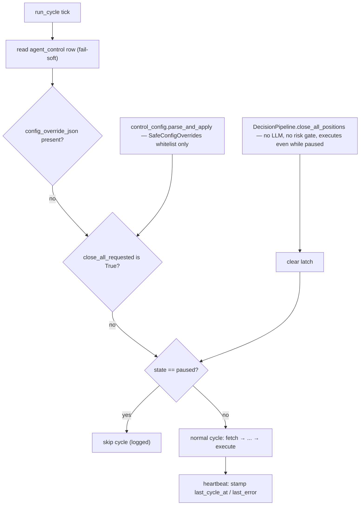
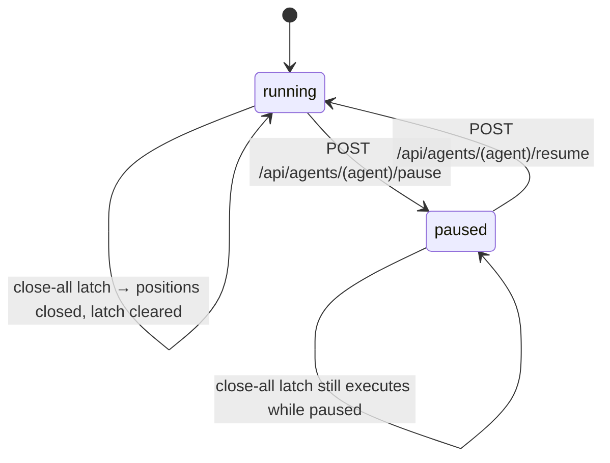
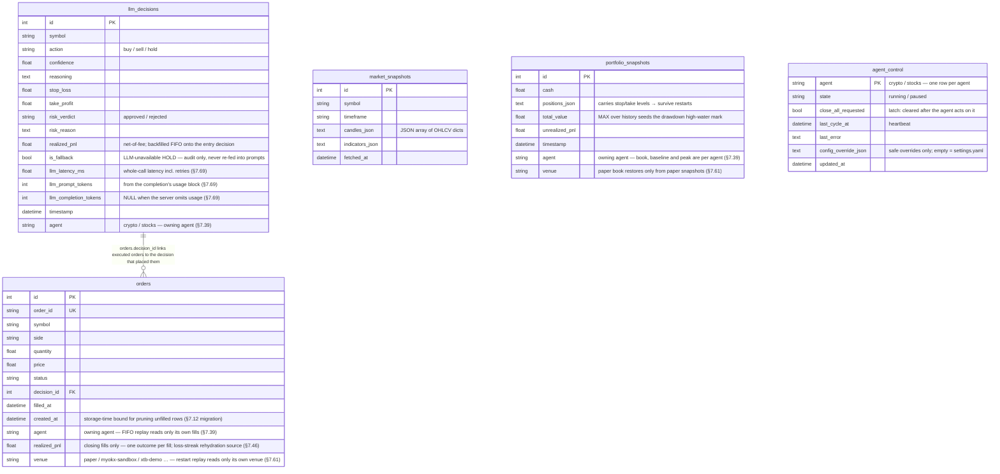
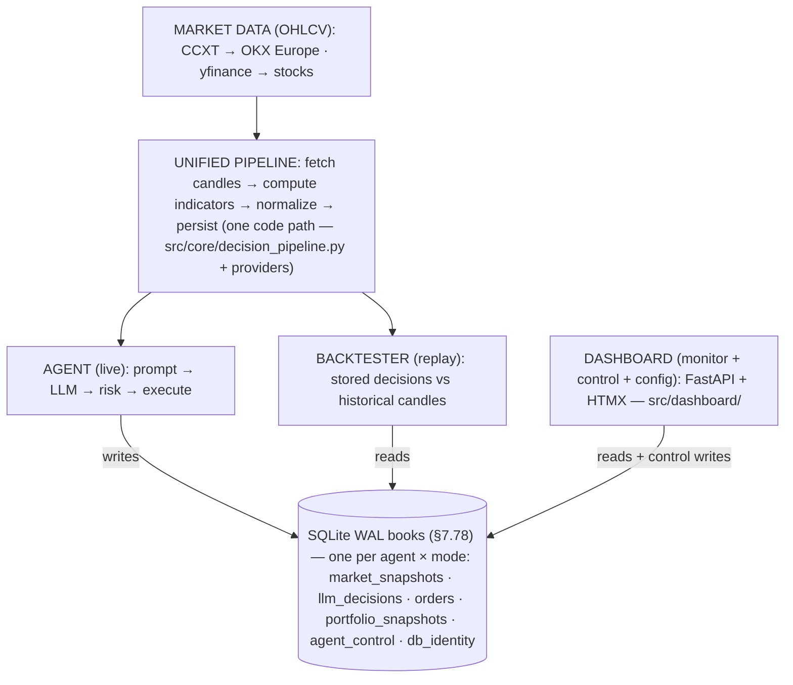

# Autonomous Trading Agent — Architecture

This document describes **how the system is built**: module layout, data flow, storage schema, the control plane, risk engine, and the design decisions behind them. Diagrams are Mermaid; verbatim contracts are marked as such.

**Document map**

- [README.md](README.md) — user-facing overview & quickstart
- **ARCHITECTURE.md** (this file) — architecture: components, data flow, schema, control plane, design decisions
- [HISTORY.md](HISTORY.md) — what has been delivered (status snapshot, original Phase 1–2 plans, completed §7 items)
- [PLAN.md](PLAN.md) — the single list of open work (§7.N identifiers are never renumbered)
- [CHANGE.md](CHANGE.md) — multi-strategy design (sleeves, allocator, research layer) — P1/P2/P4/P5 implemented, P3 allocator open
- `AGENTS.md` — agent-facing facts & rules injected into coding-agent prompts
- `docs/reviews/review.MD` / `docs/reviews/review2.md` — external full-codebase reviews (`[R-xx]` tags reference these)

## Overview

Two independent paper-trading agents sharing a common core:

| | Crypto Agent | Stocks Agent |
|---|---|---|
| **Exchange** | OKX Europe — ccxt `myokx`, EUR pairs (public data; keyed = OKX demo or ack-gated live, §7.41/§7.64) | Saxo OpenAPI (SIM, opt-in; paper by default — XTB's API closed 2025-03-14, §7.66) |
| **Data** | CCXT (OHLCV); market context (§7.18): Fear & Greed, macro calendar, OKX delisting notices, RSS news | yfinance (OHLCV, `stocks_provider.py`); market context (§7.18: macro calendar, yfinance earnings, EDGAR filings — live-checked, on) |
| **LLM** | local OpenAI-compatible server (LM Studio / Unsloth desktop) → Qwen 3.8 27B | Same shared LLM client |

Both agents use the same decision pipeline, risk engine, and storage layer — only the data sources and execution adapters differ.

## System context


```mermaid
flowchart TB
    LMStudio["LM Studio (local LLM, OpenAI-compatible)"]
    OKX["OKX Europe (public OHLCV / demo / keyed live)"]
    StocksSrc["yfinance / xAPI (stocks data)"]

    subgraph agents["src/agents — market shells"]
        CA["CryptoAgent (24/7)"]
        SA["StocksAgent (+ market-hours guard)"]
    end

    subgraph core["src/core — shared infrastructure"]
        RUNNER["runner.py — lifecycle factory: enabled-gate, wiring, --once/scheduled loops"]
        PIPE["decision_pipeline.py — indicators, prompt, risk gate, persistence"]
        RISK["risk_engine.py — 7 deterministic rules"]
        LLMCLI["llm_client.py — retry + JSON parse + HOLD fallback"]
        STORE["core/storage/ package — SQLite repository (WAL)"]
        CTRLAPI["control_api.py — FastAPI control plane (§7.15)"]
        CTRLCFG["control_config.py — safe-override whitelist"]
        BT["backtester.py — decision replay (§7.14)"]
        REHY["rehydration.py + retention.py — startup state & pruning"]
        CTX["context.py — context refresh job + per-decision reader (§7.18)"]
        SUMM["summarizer.py — batch news → context cards (§7.18)"]
    end

    subgraph data["src/data — providers"]
        CCXTP["ccxt_provider.py"]
        XTBP["stocks_provider.py"]
        CTXP["context/ — sentiment, calendar, notices, earnings, news"]
    end
    Feeds["Free context sources (alternative.me, ForexFactory, OKX announcements, RSS/EDGAR)"]

    subgraph execution["src/execution"]
        PAPER["paper_executor.py (default)"]
        KEX["ccxt_executor.py (spot)"]
        SEX["saxo_executor.py (stocks, §7.66)"]
        XEX["xtb_executor.py (dead)"]
        PT["position_tracker.py — shared FIFO realized-PnL ledger"]
    end

    DB[("SQLite WAL — one file per agent × mode (§7.78): data/paper_crypto.db · data/demo_crypto.db · …")]

    CA --> CCXTP
    SA --> XTBP
    CCXTP --> OKX
    XTBP --> StocksSrc
    CA --> PIPE
    SA --> PIPE
    PIPE --> LLMCLI
    LLMCLI --> LMStudio
    PIPE --> RISK
    PIPE --> PAPER
    PIPE --> KEX
    PIPE --> XEX
    PAPER --> PT
    KEX --> PT
    XEX --> PT
    KEX --> OKX
    PIPE --> STORE
    STORE --> DB
    BT --> STORE
    CTRLAPI --> STORE
    CTRLCFG --> CTRLAPI
    REHY --> STORE
    CTX --> CTXP
    CTXP --> Feeds
    CTX --> STORE
    SUMM --> STORE
    SUMM --> LLMCLI
    PIPE --> CTX
```

- **Layering**: `agents/` are thin market-specific subclasses of `BaseTradingAgent`; all shared lifecycle lives in `core/runner.py::run_agent` + `agents/base_agent.py` (§7.13). Market quirks hook via `_skip_cycle_reason()`.
- **One runner process per agent** (§7.52): `run_agent` holds an exclusive non-blocking `flock` (`<db-dir>/<component>.runner.lock`, acquired before anything is constructed; contention → `RunnerAlreadyRunning`, exit 2). Kernel-released on abrupt death, so two runners can never trade one DB from separate in-memory books.
- **Shutdown (§7.88/§7.89)**: one cycle at a time (`BaseTradingAgent` cycle lock; a tick during a running cycle is skipped). SIGTERM is turned into the Ctrl+C path (`runner._cancel_on_sigterm` cancels the main task), and the cleanup stops the LLM work first: `agent.stop()` blocks new cycles, the generation is cancelled and the running cycle unwinds — only then is the scheduler shut down, because APScheduler's asyncio executor cancels a running job at whatever await it is in (possibly mid-order). With `llm.cancel_path` set, every chat request carries a `cancel_id`. `LLMClient.cancel_inflight()` (also run by `close()`, and on task cancellation mid-request) POSTs `{"cancel_id": …}` to the server's cancel endpoint, which is Unsloth Studio's `/api/inference/cancel`. Without the setting, the dropped connection is the only signal. After that the client refuses new requests by raising `CancelledError`: no fallback HOLD row and no retry. The running cycle unwinds at its LLM call, and `agent.shutdown()` waits up to 5 s for it (the dashboard's Stop sends SIGKILL after 10 s).
- **Protocol seams**: providers and executors are swappable via `Protocol` interfaces (`Executor` is defined in `core/models.py`). Paper is the default executor on both markets.
- The backtester and control API read/write the *same* SQLite DB — no separate state anywhere.

## Module layout (current)

The canonical file-level map (README only summarizes the directories).

```
src/
├── core/
│   ├── models.py             # Pydantic models + Executor Protocol (single source of truth for contracts)
│   ├── config.py             # YAML + env settings loader (Settings validates config/settings.yaml)
│   ├── llm_client.py         # LM Studio HTTP client (retry, think-tolerant JSON parse §7.57, HOLD fallback, llm_exchange audit log)
│   ├── timeutil.py           # to_utc / to_naive_utc — the one pair of datetime normalizers
│   ├── costs.py              # CostModel — per-venue commission/FX schedule (paper fills, sizing, replay) (§7.65)
│   ├── risk_engine.py        # 7 deterministic risk rules (all live) + trackers (daily loss, cooldown, drawdown HWM)
│   ├── watchlist.py          # WatchlistManager: capped/TTL dynamic symbols over the screener; held/core never dropped (§7.70)
│   ├── sleeves.py            # Strategy sleeves: SleeveBook (ownership from FIFO lots' entry decisions), symbol lock, time stops, SleeveRun (§7.71)
│   ├── context.py            # ContextRefresher (fail-soft provider job) + ContextReader (SymbolContext per decision) (§7.18)
│   ├── summarizer.py         # ContextSummarizer: news items → strict ContextCards via LLMClient.ask_json (§7.18)
│   ├── storage/              # SQLite via SQLAlchemy + aiosqlite (WAL) — package (§7.36):
│   │                         # models/engine/snapshots/decisions/orders/control/pruning/watchlist/sleeves/context mixins,
│   │                         # Storage facade composed in storage.py, re-exported from __init__
│   ├── decision_pipeline.py  # fetch → mark positions → exit-level check → indicators → prompt → LLM → risk gate → execute → persist
│   │                         # + shared rule functions: exit_level_breach(), calculate_quantity() (§7.14 extraction)
│   ├── rehydration.py        # startup pass: paper book, venue ledgers/levels/pending orders (§7.58), daily-loss baseline, streak/cooldown from persisted rows (§7.7)
│   ├── retention.py          # fail-soft storage pruning wrapper (startup + scheduled) (§7.12)
│   ├── runner.py             # shared runner lifecycle: enabled-gate, single-instance flock (§7.52), wiring, control API startup, --once/scheduled loops (§7.13)
│   ├── backtester.py         # DecisionReplayBacktester — same risk/fee model over stored decisions, zero LLM calls (§7.14)
│   ├── performance.py        # sleeve_performance(): per-sleeve ledger from tagged fills + sleeve snapshots (§7.73)
│   ├── control_api.py        # agent-side FastAPI control API (pause/resume/close-all/config/status) (§7.15 P2)
│   ├── control_config.py     # SafeConfigOverrides whitelist; parse_and_apply onto live objects (§7.15 P2)
│   └── scheduler.py          # APScheduler wrapper
├── data/
│   ├── ccxt_provider.py      # Crypto OHLCV via CCXT (fetch_snapshot + paginated fetch_history + fetch_quote_volumes sweep, §7.70)
│   ├── stocks_provider.py    # StocksProvider: stocks OHLCV (yfinance source behind StockDataSource) + fetch_history
│   └── context/              # market-context providers → ContextBatch (§7.18): FearGreedProvider,
│                             #  ConfigMacroProvider + ForexFactoryProvider, OkxAnnouncementsProvider,
│                             #  EarningsProvider (yfinance), RssNewsProvider (RSS/Atom, EDGAR)
├── execution/
│   ├── paper_executor.py     # simulated executor (default): fees, slippage, net PnL, update_price marking hook, load_portfolio_state
│   ├── position_tracker.py   # shared FIFO cost-basis ledger → realized_pnl + closed_entries per entry decision (§7.8)
│   ├── ccxt_executor.py      # Keyed ccxt spot orders (OKX Europe) — demo/sandbox if the exchange has one, else ack-gated live (§7.41); spot-only ledger positions (§7.64);
│   │                         # pending orders re-polled each cycle — reconcile_open_orders, §7.28;
│   │                         #  resolved statuses re-delivered until confirm_reconciled, §7.44;
│   │                         #  venue_orders policy: crossed BUY limit, market SELL, lot size, order TTL,
│   │                         #  working_order_sides, dust write-off, fees in outcomes — §7.75)
│   ├── saxo_executor.py      # Saxo OpenAPI stocks: ledger-capped long-only, whole shares, one currency, audit-log fills (§7.66)
│   ├── saxo_client.py        # Saxo OpenAPI REST client over httpx (SIM/LIVE gateways, bearer token or OAuth token source)
│   ├── saxo_auth.py          # SaxoOAuth: authorization-code grant, 0600 token file, rotating refresh, keep-alive (§7.66)
│   ├── xtb_executor.py       # XTB demo orders (DEAD path — API closed 2025-03-14; §7.66 → Saxo)
│   └── xtb_client.py         # real xAPI WS client (§7.16) over the unofficial ws.xapi.pro relay; reference only
├── agents/
│   ├── base_agent.py         # BaseTradingAgent: cycle loop, control-row handling, post-process, snapshots, alerts (§7.13)
│   ├── crypto_agent.py       # thin subclass
│   └── stocks_agent.py       # thin subclass + weekend/holiday/timezone-aware market-hours guard (§7.10), per-exchange windows (§7.66)
├── analysis/                 # feature engineering + prompt building (§7.17, extracted from core)
│   ├── indicators.py         # compute_indicators + RSI/MACD/Bollinger/ATR helpers (pure)
│   ├── screener.py           # deterministic universe screening: liquidity floor → daily metrics → volatility band → momentum rank (§7.70)
│   ├── baselines.py          # buy & hold / 20-50 MA crossover / cash baselines, net of cost, no look-ahead (§7.73)
│   ├── context_cards.py      # summarizer prompt (items fenced as data) + parse_context_card (strict, injection checks) (§7.18)
│   ├── sanitize.py           # safe_label — external strings reduced to plain bounded text before any prompt
│   └── prompt_builder.py     # build_user_prompt (+ MARKET CONTEXT section, §7.18) + DEFAULT_SYSTEM_PROMPT
└── monitoring/
    ├── logger.py             # structlog setup
    └── alerts.py             # AlertManager + sinks (logging sink; dedup window)

scripts/
├── run_crypto_agent.py       # crypto-specific factories + shared runner
├── run_stocks_agent.py       # stocks-specific factories + shared runner
├── prune_storage.py          # out-of-band retention pruning (no agents, no trades) (§7.12)
├── rebaseline_drawdown.py    # audited CLI drawdown peak re-baseline, dry-run default (§7.53)
└── backtest.py               # decision-replay CLI (--start/--end/--days/--symbols/--provider/--timeframe/--report) (§7.14)

docs/API_NOTES.md             # OKX Europe + XTB API quirks
config/settings.yaml          # all tunables (see §Configuration below)
```

## Decision pipeline — one cycle

```mermaid
sequenceDiagram
    autonumber
    participant SCH as Scheduler / --once
    participant AG as BaseTradingAgent
    participant CTL as agent_control row
    participant PL as DecisionPipeline
    participant PR as Data provider
    participant EX as Executor (paper/venue)
    participant LLM as LLM client
    participant RE as RiskEngine
    participant ST as Storage

    SCH->>AG: run_cycle()
    AG->>CTL: read control row (fail-soft, strict checks)
    Note over AG: apply safe config overrides if present
    alt close_all_requested is True
        AG->>PL: close_all_positions() — even while paused
        Note over PL: no LLM call, no risk gate — exits only reduce exposure
    end
    alt state == paused
        AG-->>SCH: skip cycle (logged)
    end
    AG->>PL: run(symbol) per pair/symbol
    PL->>PR: fetch snapshot (OHLCV candles)
    PL->>EX: update_price(symbol, last close) — marking hook (paper only)
    Note over PL: exit-level check: breach → auto-close full quantity (no LLM, no gate), cycle ends with auto_exit=True
    Note over PL: bar timing (§7.56): split off the forming bar; if decide_on_new_bar_only and the latest closed bar is already decided → end cycle (skip_reason), no LLM call
    PL->>PL: compute indicators on closed bars only (RSI, MACD, Bollinger, ATR — hand-rolled, simple averages)
    PL->>EX: read book once (positions + cash) — reused unchanged at the gate
    PL->>ST: read market context (§7.18, if enabled): sentiment, events, delisting notices, active card
    PL->>LLM: prompt = market data + YOUR BOOK (symbol position, cash, limit headroom) + MARKET CONTEXT + last-N decisions with honest outcomes
    LLM-->>PL: TradeSignal JSON (exhausted-retries HOLD flagged is_fallback, never forgeable)
    PL->>ST: persist decision immediately after risk gate (decision_id exists before any fill)
    PL->>RE: evaluate(signal, portfolio, planned_notional = quantity × price)
    PL->>RE: BUY only — check_event_guard(signal, context) (§7.18; unreadable context → reject)
    alt approved
        PL->>EX: place_order(quantity, stop_loss/take_profit levels, decision_id)
        EX-->>PL: OrderResult (+ realized_pnl / closed_entries on closing fills via PositionTracker)
        PL->>ST: persist order row (linked to decision_id)
        AG->>ST: backfill realized PnL onto the originating entry decision (FIFO attribution)
    else rejected
        PL->>ST: decision persisted with verdict + reason; nothing sent to venue
    end
    AG->>CTL: heartbeat — stamp last_cycle_at / last_error
```

Notes:

- **Marking before gating** (§7.1): paper positions are re-marked at the snapshot's last close *before* the risk check, so unrealized PnL, portfolio snapshots and the daily-loss rule track the market. Real-venue executors report live prices and skip the hook.
- **No price, no trade** (§7.55): an empty candle series aborts `DecisionPipeline.run` before the LLM (no decision row, no order), and the execute step refuses to place without a usable mark/quantity — `price=None` orders would become unbounded market orders venue-side.
- **Bars, not cycles, drive decisions** (§7.56): candle timestamps are bar open times; `analysis/candles.py` splits off the still-forming bar — indicators use closed bars, the forming bar stays the live price (marking, exits, prompt "Current price … (live)") and is labelled `[FORMING]` in the prompt. With `decide_on_new_bar_only` the LLM is asked once per newly closed bar per symbol (last decision time in memory, from storage after a restart; fallback HOLDs don't count) while every cycle still marks and enforces exits.
- **The model sees its own book** (§7.45): the prompt's *YOUR BOOK* section carries the symbol's long position (size, entry, mark, uPnL, active SL/TP), cash vs equity and the per-symbol limit with remaining headroom; past-decision outcomes read `n/a` for HOLD/rejected/unfilled decisions and `still open` only for executed, unclosed entries (`DecisionRecord.filled` ← `Storage.get_filled_decision_ids`).
- **Sizing before gating** (§7.5): `calculate_quantity()` runs first and its notional is passed into `evaluate()`; the approved plan is reused unchanged at execution — a sizing regression cannot slip past approval. A SELL closes the whole held long (§7.47). The BUY cash clamp prices in the executor's slippage + fee (`buy_cost_factor`, §7.59 L1) so a cash-bound approval can't bounce off "insufficient cash"; quantities round down, and a SELL is the exact held size (§7.59 L2).
- **Persistence after a fill is fail-soft and lossless** (§7.44): the agent contains post-processing per symbol, retries order-row writes (audit log line + alert as last resort), and confirms reconciled venue transitions to the executor only after they are stored — so a locked/full DB never aborts a cycle, skips the heartbeat or loses a fill.
- **Closes are side-aware** (§7.48): close-all and exit enforcement send `closing_side(position)` — SELL for a long, a covering BUY for a short — and `exit_level_breach` mirrors the levels for shorts; every position in the symbol is checked (venues can hold a hedged pair).
- **The pipeline prices, the venue executor executes** (§7.75): the pipeline hands every order a *reference* price (the last close) — exactly what paper fills at. `CcxtExecutor` turns it into a venue order via `venue_orders`: BUY = limit crossed by `entry_offset_pct` (sizing reserves it through `buy_price_factor` → `sizing_cost_model`), SELL = market (an exit must fill; a limit at the bare close rested unfilled on the OKX demo), amounts floored to the lot size, sub-minimum orders never sent. Working orders are aged: past `order_ttl_seconds` reconciliation cancels them, and until then `working_order_sides` stops the pipeline from stacking a second same-side order (exits, close-all, entries). Fees the venue reports go into cost basis / realized PnL, so venue outcomes are net like paper's; a lot-size remainder is written off the ledger, never a position.
- **Exit levels bypass the gate deliberately** (§7.9): cooldown/daily-loss blocks must never strand a position. Levels ride on `Position` (persisted in portfolio snapshots → survive restarts). These are *local* checks, not venue-side stop orders.
- **Strategy sleeves** (§7.71, opt-in): the agent runs one `DecisionPipeline` per sleeve (own timeframe, playbook system prompt, `strategy` tag) per symbol, in config order. Right after marking, the pipeline resolves the symbol's owner via `SleeveBook` (open FIFO lots → entry decisions → `llm_decisions.strategy`; unknown → first sleeve). Exit levels still run first and tag the close with the owner; then the owner's **time stop** (`holding.max_hours/max_days`, clock = the oldest lot's decision time) closes like an exit level; a symbol owned by another sleeve ends the run with `skip_reason` (symbol lock — no LLM call). Bar timing and prompt history filter on the sleeve's own rows; the YOUR BOOK section adds the sleeve and its time stop.
- **Stocks data & hours** (§7.10/§7.11/§7.67/§7.68): daily stock candles come over a `"6mo"` window and hourly ones over `"1mo"`, so every timeframe feeds MACD (≥ 26 closes; `StocksProvider` warns once per symbol/timeframe when a book is shallower); candle rows with a NaN OHLC cell are dropped, never zero-filled. The market-hours guard compares the exchange's *local* wall clock (`market_timezone`) with `market_hours`, closes weekends and `market_holidays`, wraps overnight windows, and must match the traded exchange — shipped US stocks ⇒ NYSE `09:30-16:00 America/New_York`; per-exchange windows for a mixed universe via `exchanges`/`symbol_exchanges` (§7.66).
- **Market context** (§7.18, opt-in per agent): after the book read the pipeline asks `ContextReader.for_symbol` for a `SymbolContext` and renders it as the prompt's MARKET CONTEXT section; the risk engine's `event_blackout_reason` is computed first and shown as `ENTRY BLACKOUT` so the model knows a BUY would be refused. After `evaluate` (and the sleeve backstop), an approved BUY passes `check_event_guard`; an unreadable context rejects it. See *Market context* below.
- Indicators and prompt building live in `src/analysis/` (`indicators.py`, `prompt_builder.py`), extracted verbatim from `core/decision_pipeline.py` (§7.17); the pipeline now only orchestrates data → indicators → prompt → LLM → risk → execution.

## Key models (`src/core/models.py`)

| Model | Role |
|---|---|
| `TradeSignal` | LLM output: action, confidence, reasoning, stop_loss, take_profit; `is_fallback` stripped from model output — never forgeable |
| `DecisionRecord` | prior decision + realized PnL outcome, fed back into the prompt ("learn from its own track record") |
| `RiskResult` | deterministic verdict: approved / rejected + reason |
| `Position` / `PortfolioState` | portfolio tracking; positions carry entry signal's stop/take levels |
| `MarketSnapshot` | OHLCV candles + computed indicators per symbol |
| `OrderResult` | order outcome; closing fills carry `realized_pnl` + `closed_entries` (per-entry-decision PnL) |
| `Executor` | Protocol — the seam between pipeline and venue |

## Executor protocol

All executors implement the same `Executor` Protocol (defined in `src/core/models.py`); `place_order` additionally accepts `decision_id` (§7.8) and `stop_loss`/`take_profit` levels (§7.9), and optional hooks (`update_price`, `load_portfolio_state`) are duck-typed:

All executors implement the same `Executor` Protocol (defined in `src/core/models.py`):

```python
class Executor(Protocol):
    async def place_order(
        self,
        symbol: str,
        side: OrderSide,
        quantity: float,
        price: float | None = None,
    ) -> OrderResult: ...
    async def get_positions(self) -> list[Position]: ...
    async def cancel_order(self, order_id: str) -> bool: ...
    async def get_cash(self) -> float: ...
```

- `ccxt_executor.py` — `CcxtExecutor`, keyed ccxt **spot** (OKX Europe, `myokx`; mode `<exchange>-sandbox` = OKX demo trading; `<exchange>-LIVE` only with `live_trading: true` + `LIVE_TRADING_ACK`, §7.41); cash = free balance of `crypto_agent.quote_currency` (EUR); positions always from the FIFO fill ledger capped by `fetch_balance` totals — `fetch_positions` is never used (OKX serves it for margin/derivatives only, `[]` for spot; §7.64); real fill payload parsing (fill time from ccxt's `lastTradeTimestamp`, reported base/quote fees booked into cost basis and net realized PnL; OKX's id-only `create_order` ack is resolved by one `fetch_order`); venue order terms and order TTL from `venue_orders` (`VenueOrderSettings`, §7.75); credentials `EXCHANGE_API_KEY`/`_SECRET`/`_PASSPHRASE`.
- `saxo_executor.py` — `SaxoExecutor` over `saxo_client.py::SaxoClient` (§7.66): Saxo OpenAPI stocks, SIM by default (`saxo-sim`; `saxo-live` only with `LIVE_TRADING_ACK`). Long-only whole shares from one account/currency (instruments quoted elsewhere are refused); positions = FIFO ledger capped by `/port/v1/netpositions/me`; market orders whose fills come from the order-activity audit log (`FinalFill` → `AveragePrice`, §7.62 sanity check), still-working orders reconciled per cycle (two-phase, §7.44); `load_fills`/`load_pending_orders` restart hooks (§7.58); data symbols mapped only at the edge (`symbol_map`).
- `xtb_executor.py` — **DEAD PATH (2026-09-26): XTB closed its API access on 2025-03-14; kept disabled as reference until the Saxo executor replaces it (PLAN §7.16 → §7.66).** xAPI demo trading, now over the **real client** `execution/xtb_client.py::XApiClient` (§7.16). **Reduce first, never flip (§7.40):** an order opposite to open trades closes them FIFO via `close_trade` (`type=CLOSE` + the trade's `order` number); a SELL with nothing to close is refused (long-only; `allow_short` opt-in). Transport: WebSocket transactions to `wss://ws.xapi.pro/{demo,real}`, classic `login` auth (account id + xAPI verification code — *not* OAuth2; that endpoint does not exist), instant orders + status polling, live position marks via `getTickPrices`. Opt-in only (`xtb_execution.enabled` + env credentials); paper stays default. Data ↔ xAPI symbol names go through `xtb_execution.symbol_map` (§7.59 L8), translated only at the client boundary inside the executor. Fills are booked at the **venue's** price (§7.62): once `tradeTransactionStatus` says ACCEPTED the client reads the trade record (`getTrades` `open_price` / `getTradesHistory` `close_price`) and returns it with `price_source: "venue"`; fail-soft fallback to the requested price (`"requested"`) on no match, an error, or a > 20 % deviation.
- `paper_executor.py` — Pure simulation. No network calls. Tracks virtual portfolio state; per-side fees + slippage; net-of-fee `realized_pnl`. **Default for all testing.**

## Risk engine (`core/risk_engine.py`)

Hard-coded, non-negotiable gates in `risk_engine.py` (built Week 2 ✅). `RiskEngine.evaluate()` runs all of these, in order, on every **entry** (BUY). A SELL closes a held long and only reduces exposure, so it is checked for confidence alone — daily loss, drawdown, cooldown and size never strand a position — and a SELL with no long position is rejected (§7.47):

| Rule | Default | Configurable | Implementation |
|---|---|---|---|
| Min confidence | `0.6` to trade | Yes | `_check_confidence` |
| Max open positions | 5 per agent | Yes | `_check_max_positions` |
| Max position size | 10% of portfolio per symbol — existing long exposure + planned BUY (§7.42) | Yes | `_check_position_size` |
| Daily loss limit | -2% of starting balance | Yes | `_check_daily_loss` |
| Max drawdown | -5% below the **peak-equity** high-water mark (seeded from persisted portfolio snapshots) | Yes | `_check_drawdown` ✅ (§7.5) |
| Consecutive-losses cooldown | 3 losses → 60-min pause | Yes | `_check_cooldown` |
| Stop-loss required | Entries (BUY) must include a stop-loss; closes are exempt since §7.9 | No | `_check_stop_loss` |
| Event guard (§7.18) | No BUY within 120 min before / 60 min after a high-impact macro event, from 1 day before to 24 h after the asset's earnings, or for 90 days after a venue delisting notice; context unreadable → no BUY | Yes (`risk.event_*`, `earnings_*`, `delisting_blackout_days`) | `check_event_guard` (after `evaluate`; pipeline calls it only when context is enabled) |

> The earlier "-5% drawdown → halt for 24h" phrasing is not how the code behaves: there is no time-based halt. The 24-hour-scale protection is the **consecutive-losses cooldown** (3 losses → 60 min; both the streak and the pause are configurable via `consecutive_losses_threshold` / `consecutive_losses_cooldown_minutes`, §7.19).

Additional engine facts:

- The drawdown high-water mark is seeded at startup from `Storage.get_effective_peak_equity()` (`seed_peak_equity`, fail-soft), so it survives restarts (§7.5). The seed is reset-aware (§7.53): with a `drawdown_resets` row it becomes `max(baseline_value, MAX(total_value since reset_at))` — the operator's audited CLI exit from a permanently-latched guard (`scripts/rebaseline_drawdown.py`, dry-run by default; no dashboard equivalent by design).
- Daily-loss baseline and losing-streak/cooldown are rehydrated from persisted rows by `core/rehydration.py` (§7.7). `_check_daily_loss` rolls the UTC day itself (§7.59 L3) — the post-processing rollover alone left the first check after midnight on yesterday's baseline.
- The size cap is per **position** (§7.42): `long_exposure(portfolio, symbol)` is added to a BUY's planned notional at the gate, and `calculate_quantity` sizes BUYs to the remaining headroom — repeated entries cannot pyramid past the cap.
- **Strategy sleeves (§7.71):** each sleeve has its own `RiskEngine` evaluating the **sleeve's book** (`SleeveBook.sleeve_equity`: `weight × base_equity` of the latest `strategy_allocations` row + the sleeve's realized PnL since + unrealized PnL of owned positions; cash = equity − owned market value), so all seven rules run per sleeve with the sleeve's limits (agent `risk:` block + sleeve `risk:` overrides; agent-wide safe-config tightening caps every sleeve). Sizing is additionally clamped to the agent's free cash. The agent engine keeps the portfolio-snapshot-seeded peak for one loose **backstop** (`check_backstop`, `sleeves.backstop_max_drawdown_pct`) on BUYs. Sleeve trackers rehydrate from `sleeve_snapshots` (peak since the allocation, today's first row) and tagged closing fills.
- **Event guard (§7.18):** calendar data only (`MarketEvent` rows from the YAML list, ForexFactory, OKX notices, yfinance earnings) — never summarizer text. It gates entries only, like every other rule since §7.47; a sleeve applies its own settings (the fields are ordinary `RiskSettings`, overridable per sleeve). Decision replay (§7.14) applies the same guard over the book's stored `market_events` (§7.82): each replayed BUY sees the calendar around its own timestamp, but only from the first stored event on (`event_guard_since`) — before that the live agent had no guard; report fields `event_guard` / `event_guard_since` / `event_blocked`, CLI `--event-guard auto|on|off`.
- Sizing + exit-level rules are *shared functions* (`calculate_quantity`, `exit_level_breach` in `decision_pipeline.py`) so live, paper and replay can never drift (§7.14).

## Control plane (§7.15 P1/P2 — implemented)

The DB is the control source of truth: one `agent_control` row per agent. The agent-side FastAPI control API writes latches; the agent obeys them at the top of every cycle.


```mermaid
flowchart TD
    START["run_cycle tick"] --> READ["read agent_control row (fail-soft)"]
    READ --> OVR{"config_override_json present?"}
    APPLY["control_config.parse_and_apply — SafeConfigOverrides whitelist only"]
    OVR -- no --> LATCH
    APPLY --> LATCH{"close_all_requested is True?"}
    CLOSEALL["DecisionPipeline.close_all_positions — no LLM, no risk gate, executes even while paused"]
    CLOSEALL --> CLEAR["clear latch"]
    LATCH -- no --> PAUSE
    CLEAR --> PAUSE{"state == paused?"}
    PAUSE -- yes --> SKIP["skip cycle (logged)"]
    PAUSE -- no --> CYCLE["normal cycle: fetch → ... → execute"]
    CYCLE --> HB["heartbeat: stamp last_cycle_at / last_error"]
```

All checks are strict (`is True` / equality) and the control-row read is fail-soft — **a broken control plane never halts trading nor fabricates actions.**


```mermaid
stateDiagram-v2
    [*] --> running
    running --> paused: POST /api/agents/(agent)/pause
    paused --> running: POST /api/agents/(agent)/resume
    running --> running: close-all latch → positions closed, latch cleared
    paused --> paused: close-all latch still executes while paused
```

### Control API (implemented)

`core/control_api.py::create_control_app(storage, agent_name, settings, get_positions)` — started in-process by `core/runner.py` only when `control_api.enabled` (default **false**); loopback-bound; ports crypto 8101 / stocks 8102.

| Method & path | Effect |
|---|---|
| `GET /healthz` | liveness |
| `GET /api/agents` / `GET /api/agents/{agent}` | state, positions, portfolio, recent decisions, errors |
| `GET /api/agents/{agent}/decisions?limit=N` | recent decisions + outcomes (fallback rows included — audit view) |
| `GET /api/agents/{agent}/portfolio?limit=N` | current + historical portfolio value |
| `POST /api/agents/{agent}/pause` / `resume` | write `state` in `agent_control` (never orders) |
| `POST /api/agents/{agent}/close-all` | set `close_all_requested` latch — executed on next cycle tick, even while paused |
| `GET /api/config` | safe config view: YAML defaults + stored overrides (whitelisted fields only) |
| `PUT /api/config` | body must validate as `SafeConfigOverrides` (`extra="forbid"`); unknown/credential keys rejected wholesale with 400 |

**Safety invariants:** credentials are *structurally absent* from every endpoint — responses are field-built from safe models; the LLM endpoint/model, storage path and any `.env` secret can neither appear in a response nor be written. `SafeConfigOverrides` (`core/control_config.py`) covers: `interval_minutes` (applies immediately — stored overrides are applied *before* scheduling at startup, and a live change re-arms the APScheduler job via `AsyncSchedulerManager.reschedule_cycle`, §7.50), `pairs`, `symbols`, `market_hours` (read per cycle by `StocksAgent` from the live settings object — single reader, §7.50), `decision_history_limit`, `risk.*` (**tighten-only** vs the YAML limits in `Settings.risk_baseline`, checked at write and apply time; `enforce_exit_levels` excluded — §7.43), paper-executor fee/slippage under `execution.*`. Every apply resolves each field as *YAML baseline + override* (`Settings.agent_baselines` / `risk_baseline` / `execution_baseline`), so removing an override reverts the live objects; saves persist only fields differing from YAML (`strip_noop_overrides`), and the agent re-applies on override **transitions** including → cleared (§7.50). Both web apps run behind `core/web_security.py` guards (§7.43): `TrustedHostMiddleware` (Host allowlist: loopback + bind host + `allowed_hosts` — blocks DNS rebinding, reads included) and `OriginGuardMiddleware` (writes with a foreign `Origin`/`Referer` → 403); the dashboard also requires its per-process CSRF token on every write. It is deliberately *not* applied to live objects mid-flight beyond that whitelist; risk thresholds mutate the shared `RiskSettings`, paper fee/slippage land on the executor.

## Storage schema & retention

- **One SQLite file per agent × trading mode (§7.78):** `<storage.data_dir>/<mode>_<agent>.db` (`data/paper_crypto.db`, `data/demo_crypto.db`, `data/real_crypto.db`, …), each run in **WAL mode** so the dashboard can read while its agent writes. The mode is **derived from the executor's venue tag** (`core/db_layout.py`: `paper` → paper; `*-sandbox`/`saxo-sim`/`xtb-demo` → demo; `*-live`/`saxo-live`/`xtb-real` → real; anything else raises `UnknownVenueError`) — never configured, so a typo can't point real trading at a paper file. Every file records `(agent, mode)` in a **`db_identity`** meta table at creation and `Storage` refuses a foreign file (`DatabaseIdentityError`). Control-API ports are offset per mode (paper +0 / demo +10 / real +20); `real_*.db` never prunes decisions/orders. The pre-§7.78 shared `trading_agent.db` (split 2026-09-28) is archived in `data/backups/legacy-20260930/`; no code reads it.
- Trade tables: `market_snapshots`, `llm_decisions`, `orders`, `portfolio_snapshots`; plus `drawdown_resets` (one audited peak re-baseline row per agent — baseline value + timestamp, §7.53), `strategy_allocations` (audited sleeve capital split: agent, venue, cost-basis `base_equity`, `weights_json`, reason — a row per weights change, §7.71), `sleeve_snapshots` (per-cycle sleeve equity/cash/realized/unrealized/open positions — never pruned; seeds each sleeve's peak + daily baseline, §7.71), `sleeve_drawdown_resets` (audited per-sleeve peak re-baseline, PK agent+strategy, §7.71) and `watchlist_entries` (agent-scoped dynamic symbols added by the screener: symbol, source, added_at, expires_at TTL, ranking meta_json; self-expiring, §7.70).
- **No column migrations (2026-09-30):** `Storage.initialize` only creates missing tables (`create_all`); the old `ALTER TABLE` migrations and the §7.39 agent backfill were removed once every book was current. A future column change ships its own one-off migration.
- **Market-context tables (§7.18, agent-scoped, additive):** `market_events` (source, kind `macro`/`earnings`/`delisting`, asset or NULL = market-wide, currency, `at`, importance, title, url, `dedup_key`), `sentiment_readings` (source, value, label, as_of), `news_items` (feed, url, title, plain-text `body` — summarizer input only, `symbols_json`, `content_hash`) and `context_cards` (validated `card_json`, model, `news_through`, `expires_at` TTL). Writes are idempotent (dedup keys); calendar feeds re-sync their published window so moved/cancelled events stop blocking. Pruned after `storage.context_retention_days` (default 30) by the regular retention pass.
- **Strategy tag (§7.71):** `llm_decisions.strategy` and `orders.strategy` (nullable; NULL = no sleeves) name the sleeve that decided / placed the order (a close is tagged with the *owning* sleeve). Ownership itself is not stored — it is derived from the executor ledger's open lots and these decision rows, so it is exactly as restart-safe as the ledger.
- **Agent scoping (§7.39, second layer after §7.78):** within one file, `llm_decisions`, `orders` and `portfolio_snapshots` carry an indexed `agent` column (`crypto`/`stocks`). A runner's `Storage(path, agent=component)` stamps every write and filters every read of those tables on it — each agent has its own book, daily baseline, drawdown peak, loss streak, FIFO replay and prompt history. Unbound storage (dashboard, CLIs) reads across agents or narrows with an explicit `agent=`. `market_snapshots` is a symbol-keyed candle cache and stays unscoped. Queries filter through one helper, `StorageBase._where_agent(stmt, column, agent)`; writes stamp `_agent_scope(agent)`.
- **New table — `agent_control`** (control plane, dashboard read/write):

  | Column | Purpose |
  |---|---|
  | `agent` | `crypto` / `stocks` — one control row per agent |
  | `state` | `running` / `paused` (pause/resume) |
  | `close_all_requested` | boolean latch — agent closes all open positions then clears it |
  | `status` / `last_cycle_at` / `last_error` | live health for the dashboard |
  | `config_override_json` | **safe** config overrides (see #6); empty = use `settings.yaml` |

  The agent checks `agent_control` at the top of every cycle (cheap SQLite read) → respects pause + close-all. This keeps the DB the single source of truth even though the dashboard *triggers* actions via the control API.


```mermaid
erDiagram
    llm_decisions ||--o{ orders : "orders.decision_id links executed orders to the decision that placed them"
    market_snapshots {
        int id PK
        string symbol
        string timeframe
        text candles_json "JSON array of OHLCV dicts"
        text indicators_json
        datetime fetched_at
    }
    llm_decisions {
        int id PK
        string symbol
        string action "buy / sell / hold"
        float confidence
        text reasoning
        float stop_loss
        float take_profit
        string risk_verdict "approved / rejected"
        text risk_reason
        float realized_pnl "net-of-fee; backfilled FIFO onto the entry decision"
        bool is_fallback "LLM-unavailable HOLD — audit only, never re-fed into prompts"
        float llm_latency_ms "whole-call latency incl. retries (§7.69)"
        int llm_prompt_tokens "from the completion's usage block (§7.69)"
        int llm_completion_tokens "NULL when the server omits usage (§7.69)"
        datetime timestamp
        string agent "crypto / stocks — owning agent (§7.39)"
    }
    orders {
        int id PK
        string order_id UK
        string symbol
        string side
        float quantity
        float price
        string status
        int decision_id FK
        datetime filled_at
        datetime created_at "storage-time bound for pruning unfilled rows (§7.12 migration)"
        string agent "owning agent — FIFO replay reads only its own fills (§7.39)"
        float realized_pnl "closing fills only — one outcome per fill; loss-streak rehydration source (§7.46)"
        string venue "paper / myokx-sandbox / xtb-demo … — restart replay reads only its own venue (§7.61)"
    }
    portfolio_snapshots {
        int id PK
        float cash
        text positions_json "carries stop/take levels → survive restarts"
        float total_value "MAX over history seeds the drawdown high-water mark"
        float unrealized_pnl
        datetime timestamp
        string agent "owning agent — book, baseline and peak are per agent (§7.39)"
        string venue "paper book restores only from paper snapshots (§7.61)"
    }
    agent_control {
        string agent PK "crypto / stocks — one row per agent"
        string state "running / paused"
        bool close_all_requested "latch: cleared after the agent acts on it"
        datetime last_cycle_at "heartbeat"
        text last_error
        text config_override_json "safe overrides only; empty = settings.yaml"
        datetime updated_at
    }
```

Retention policy (§7.12, `core/retention.py` + `scripts/prune_storage.py`, which walks every book in `storage.data_dir` with its own mode, §7.78 — a `real_*.db` never prunes decisions/orders): market snapshots default to 30-day retention (re-creatable cache); decisions/orders kept forever unless `history_retention_days > 0`; **`portfolio_snapshots` are never pruned** — they seed the drawdown high-water mark (escapable only via the audited `drawdown_resets` row, §7.53). Pruning runs at runner startup and on `storage.prune_interval_minutes`, fail-soft.

Rehydration (§7.7): at startup, `core/rehydration.py` restores — from the runner's *own* agent-scoped rows (§7.39) — the paper book (latest portfolio snapshot via `load_portfolio_state`), venue executors' local state (§7.58: `load_fills` replays the agent's non-paper filled orders into the ccxt/XTB FIFO ledger and re-arms each open symbol's latest entry SL/TP from its decision row; `load_pending_orders` re-tracks `pending` rows so the first cycle's reconciliation resolves them). Book/fill/pending reads are **venue-scoped** (§7.61): the runner calls `storage.bind_venue(executor.venue)` so every order/portfolio row is stamped (`paper`, `<exchange>-sandbox`/`-live`, `xtb-demo`/`-real`), and rehydration reads only the executor's own venue — a venue → paper or sandbox → live switch never restores foreign history. **Risk seeds are venue-scoped too (§7.76):** the drawdown peak (incl. the §7.53 reset row, now stamped with its venue), the daily-loss baseline and the loss streak read *exactly* the bound venue, and `run_agent` seeds the peak only after `bind_venue`. Every row is venue-stamped (the pre-§7.61 paper snapshots were stamped `paper` on 2026-09-30), and the loss streak comes from closing fills only. This reverses §7.61's "peak stays agent-wide (fail-safe)" choice: in practice the latch was permanent and silent. A 100,000 paper peak rejected every BUY on the 4,600 EUR OKX demo, and only an audited re-baseline could clear it. Each account still keeps its own high-water mark across restarts. Reconciled partial fills (a cancel/expiry with `filled > 0`) are recorded `filled` at the traded amount and `update_order_status(quantity=…)` persists it. Venue-reported fees ride on the row too (`orders.fee_base`/`fee_quote`, §7.77). `replay_fills` books each stored fill through `position_tracker.book_fill`, the same rule as the live fill, so a rebuilt ledger is net of base-coin fees with fee-inclusive cost basis. Cash committed to BUYs the ledger hasn't booked yet (a resting limit, or a fill whose status poll timed out) is carried as `PortfolioState.pending_value`, via `core/portfolio.py::read_portfolio` and the venue executors' `pending_buy_value()` (§7.79). It is equity, never spendable cash, so the risk gates and snapshots don't see a fake dip before reconciliation catches up. The pass also restores the daily-loss baseline (today's earliest snapshot) and losing-streak/cooldown (trailing **closing fills** — `orders.realized_pnl`, one per closing fill like the live tracker, §7.46). `execution.initial_cash` only seeds a fresh (empty) portfolio.

## Data pipeline, storage & dashboard (Week-6 design)

This section holds the **design decisions** locked in Week 6 — the data pipeline / DB / control architecture that backtesting (§7.14, delivered), the dashboard (§7.15 — fully delivered through Docker packaging), and the live agent all share. It is the source of truth for *how data flows*.

### Design decisions (locked)

| # | Decision | Chosen |
|---|---|---|
| 1 | Backtest type | **(a) Decision replay** — re-simulate *stored* `llm_decisions` against the price path that followed. Deterministic, **zero LLM calls**. (LLM replay = non-deterministic + expensive on the local 27B model; deferred.) |
| 2 | Backtest price history | **Fresh historical candles** from the source (OKX Europe via CCXT / yfinance) for arbitrary date ranges — the agent does not run 24/7, so stored `market_snapshots` alone is too sparse. Stored snapshots are kept as a secondary/audit source. |
| 3 | Dashboard control scope | **Pause/resume** + **close all open positions** + **safe config management** (see #6). No manual order placement, no live risk-param override, no kill in v1. |
| 4 | Agent ↔ dashboard control channel | **Agent exposes a small HTTP control API (FastAPI); the dashboard calls it** — real-time control (e.g. "close all" is immediate, not gated on the 5-min cycle). |
| 5 | Dashboard stack | **FastAPI + Jinja2/HTMX** (server-rendered, HTMX for updates + control), lightweight chart lib (uPlot) via CDN for time-series. No Node/npm build step → one slim Docker image. |
| 6 | Config management | Dashboard edits **safe data only** — intervals, pairs/symbols, `risk.*`, `execution.*`, `monitoring.*`, `decision_history_limit`. **Never** `llm.*` credentials/endpoints, never API keys, never `.env`. |
| 7 | Database | **One SQLite (WAL mode) on a shared Docker volume.** Agent = primary writer; dashboard = reader + control writer; backtester = reader. Keeps the existing SQLAlchemy + aiosqlite stack. |
| 8 | Pipeline shape | **Single unified pipeline** (one code path: provider → indicators → store) feeding all three consumers (agent, dashboard, backtester). |

### Data flow — one path, three consumers


```mermaid
flowchart TD
    MD["MARKET DATA (OHLCV): CCXT → OKX Europe · yfinance → stocks"]
    UP["UNIFIED PIPELINE: fetch candles → compute indicators → normalize → persist (one code path — src/core/decision_pipeline.py + providers)"]
    AGENT["AGENT (live): prompt → LLM → risk → execute"]
    BT["BACKTESTER (replay): stored decisions vs historical candles"]
    DASH["DASHBOARD (monitor + control + config): FastAPI + HTMX — src/dashboard/"]
    DB[("SQLite WAL books (§7.78) — one per agent × mode: market_snapshots · llm_decisions · orders · portfolio_snapshots · agent_control · db_identity")]

    MD --> UP
    UP --> AGENT
    UP --> BT
    AGENT -- "writes" --> DB
    BT -- "reads" --> DB
    DASH -- "reads + control writes" --> DB
```

> The **live agent** and the **backtester** both read the *same* indicator logic and (for backtest) the same decision rows — so what you backtest is exactly what the pipeline produces. The backtester does **not** re-run the LLM; it re-simulates the recorded decisions.

### Control API contract (original design)

The agent process serves a small internal API (in-process with the loop, or a thin sidecar):

| Method & path | Effect |
|---|---|
| `GET /api/agents` | state, `last_cycle_at`, open positions, recent decisions, `last_error` (per agent) |
| `GET /api/agents/{agent}/decisions?limit=N` | recent decisions + outcomes (net PnL) |
| `GET /api/agents/{agent}/portfolio` | current + historical portfolio value |
| `POST /api/agents/{agent}/pause` | set `state=paused` |
| `POST /api/agents/{agent}/resume` | set `state=running` |
| `POST /api/agents/{agent}/close-all` | set `close_all_requested` latch (immediate on next loop tick) |
| `GET /api/config` | **safe** config (credentials/keys redacted) |
| `PUT /api/config` | validate against Pydantic `Settings`, persist safe overrides to `agent_control`, reload agent |

> **Safety:** `PUT /api/config` only accepts the safe whitelist (#6); unknown/credential keys are rejected. The LLM endpoint, model, and any `.env` secret are **never** read, written, or returned.

> As implemented in P2, this contract gained `GET /healthz`, a per-agent status route (`GET /api/agents/{agent}`), and the whitelist enforcement described in §Control plane above. The safety note stands unchanged.

### Dashboard (§7.15 P3/P4 — implemented)

Standalone app (`src/dashboard/app.py::create_dashboard_app`, launched by `scripts/run_dashboard.py` on `dashboard.host:port`, default loopback `127.0.0.1:8080`). Opens **every book** it finds in `storage.data_dir` (§7.78 `books.py::open_books`) and reads each as a WAL reader, routing every page/latch write/config save/launch to exactly one book's `Storage`. No HTTP coupling to the agent process, so it works whether or not `control_api.enabled`.

- **Times:** pages render stored naive-UTC timestamps in `dashboard.timezone` (shipped `Europe/Bratislava`; null = host zone, i.e. UTC in a container) and say so in the header ("times in CEST"); the uPlot chart is localized by the browser.
- **LLM knobs on the Config page (§7.91):** `LLMOverride` (`max_tokens` 1024–65536, `timeout_seconds` 30–3600, `temperature` 0–1, `reasoning`) is applied by `parse_and_apply` onto the same `LLMSettings` object the trading `LLMClient` reads per request (timeout passed per request; the summarizer keeps its own copy), baseline `Settings.llm_baseline`. The save handler refuses, with the numbers, a timeout below a full answer at the measured speed (`llm_status.llm_budget_problem`, ×1.2 margin) and a largest-prompt + cap beyond the context of the last probe. The form shows effective values (override, else YAML) for every section — it used to show YAML risk/execution values, so re-saving dropped a risk override.
- **LLM status (overview):** `/partials/llm?book=` (HTMX, loaded after the page, every 15 s) — `dashboard/llm_status.py` probes the server's OpenAI-compatible `GET /v1/models` (cached 15 s, 3 s timeout; Unsloth Studio adds *loaded* + context length) and shapes the book's stored per-decision numbers (`get_llm_latency_stats`: avg/p50/p95/max response time, tokens/s, tokens per answer vs `max_tokens`, largest prompt + answer cap vs the context, last answer, fallback HOLDs — fallbacks never count in timing). No `llm.*` value (model name, endpoint) is shown.
- **Monitor:** overview page (portfolio cards — Total value also shows the overall return vs the capital put in, in % and in the book's currency, e.g. `+9.24% (+425.00 €)` — `views.py::capital_return` / `signed_money` / `book_currency` — + uPlot portfolio-value chart refreshed from `/api/portfolio.json` — total value, cash and a dashed *Capital in* line at the book's first snapshot on its current venue (`Storage.get_first_portfolio_snapshot`; no deposit history is recorded, so later top-ups are not reflected), recent decisions), positions page — all per *book* via `?book=<mode>_<agent>` (§7.78: default first book; an unknown key 404s; books are never blended, §7.39) — decisions page (all books merged by timestamp with an Agent column, or one book via the picker) with win-rate / avg-confidence / confidence-histogram stats (`views.py::decision_stats`), health cards refreshed via HTMX polling of `/partials/health` every `dashboard.refresh_seconds`. The health badge shows an **effective status** (`views.py::agent_status`), not the raw latch: `disabled` → `paused` (latch) → `offline` when the heartbeat (`last_cycle_at`) is missing or older than 2× the agent's `interval_minutes` (floored at 10 min, +5 min grace) → else `running`. Agents stamp that heartbeat after every cycle *and* on market-hours skips (pause returns before it — its latch renders instead), so liveness never false-alarms in quiet windows.
- **Sleeve ledger (§7.73):** the sleeve table also shows each sleeve's live record since its allocation — max drawdown over its snapshots, closed trades, win rate, profit factor, average holding time (`core/performance.py::sleeve_performance` over its tagged filled orders, FIFO-replayed for holding time).
- **Strategy sleeves (§7.71):** when sleeve snapshots exist, the positions page adds a per-sleeve table (weight, allocated capital, equity, return, realized/unrealized, drawdown vs the sleeve's effective peak, open positions — `views.py::sleeve_rows`) and a Sleeve column (latest tagged BUY per symbol, `Storage.get_position_strategies`); the decisions table has a Sleeve column. Read-only — a sleeve re-baseline is CLI-only (`rebaseline_drawdown.py --strategy`).
- **Control:** Pause / Resume, Close all — HTMX `POST /control/{agent}/{action}` writes the `agent_control` latches **directly** (same repository methods as the agent-side control API); running agents honor them on their next cycle via `_handle_control`.
- **Log viewer:** `/logs/{key}` tails `data/agent_<key>.out.log` (the captured output of dashboard-launched runners, keyed per book §7.78) — last ~64 KiB / 400 lines (`views.py::tail_lines`), HTMX-polled partial refresh, linked from health cards when a log exists. Read-only; path built only from the book keys in `storage.data_dir`.
- **Launch (opt-in, §7.24):** when `dashboard.allow_launch` is true, health cards gain **Start**/**Stop (pid …)** buttons (`POST /launch/{agent}/{action}`). `src/dashboard/launch.py::AgentLauncher` spawns the same entry points you'd run by hand — `python -m scripts.run_<agent>_agent --mode <mode>` for a compound book key like `demo_crypto`, plain for legacy keys (§7.78) — as local subprocesses; enabled-gates, risk rules and paper-by-default execution apply unchanged; child output appends to `data/agent_<key>.out.log`, pid goes to `data/<key>_agent.pid`. Children outlive the dashboard (killing the UI never halts trading); a restarted dashboard re-adopts old children only when the pidfile's pid is alive AND its `/proc` cmdline still matches the runner module *and* (mode-keyed book) carries that exact `--mode` — foreign/recycled pids are never killed, and Stop only ever targets launched/adopted processes. Start refuses (409) on fresh heartbeats (no double-trading), disabled agents, or already-managed ones; 403 wholesale when supervision is off. Off under docker-compose (services belong to compose there).
- **Browser safety (§7.43):** Host allowlist + cross-origin write rejection (shared with the control API) and a per-process CSRF token embedded in every page (`<body hx-headers>` for HTMX, hidden `csrf_token` field in the config form) and required by every write route.
- **Config:** server-rendered form (`GET/POST /config/{agent}`) over the safe config surface only (risk limits tighten-only); the urlencoded body is parsed into the nested payload and validated server-side through `validate_overrides_payload` → `SafeConfigOverrides` (`extra="forbid"` — any unknown/credential-shaped key rejects wholesale, and the form re-renders with the rejection); accepted values persist to `agent_control.config_override_json` — only after `strip_noop_overrides` drops fields merely echoing the YAML baseline, so saving never pins defaults (§7.50). No credential/secret fields exist in the form.

### Container / volume topology (§7.15 P5 — implemented)

One slim image (`Dockerfile`: python:3.11-slim, non-root `appuser`; installs the package itself + `[stocks]` — dashboard templates ship as package-data via explicit setuptools discovery) serves all four services of `docker-compose.yml`:

```
docker compose up -d --build            # crypto agent + dashboard; backtester: docker compose run --rm backtester --days 30
├── agent-crypto     # scripts/run_crypto_agent.py   (control API in-process if enabled)
├── agent-stocks     # scripts/run_stocks_agent.py   (`stocks` profile — opt-in, §7.59 L6: a disabled runner exits 0 and would restart-loop)
├── dashboard        # scripts/run_dashboard.py      (bound to loopback on the host: 127.0.0.1:8080; /healthz healthcheck)
└── backtester       # scripts/backtest.py           (`tools` profile — never started by `up`, restart: "no")
    volume: agent-data → /app/data      # named volume: every per-mode book + WAL files (§7.78)
    bind:   ./config  → /app/config:ro  # read-only (see deviation note below)
```

- **One shared `agent-data` volume** holds the SQLite DB (agent writes, dashboard/backtester read). WAL mode permits concurrent read/write.
- **Deviation from the locked design:** `config/` is a **read-only bind mount**, not an `agent-config` named volume — nothing ever writes config files (safe overrides live in `agent_control` DB rows), so host edits stay authoritative on container restart instead of going stale inside a pre-seeded volume.
- Secrets enter only via compose environment substitution (`${EXCHANGE_API_KEY:-}`, `${XTB_ACCOUNT_ID:-}`/`${XTB_ACCOUNT_PASSWORD:-}` etc. — empty keeps the paper executor); `.dockerignore` guarantees `.env` is never baked into an image. The host's LLM server (LM Studio, Unsloth desktop, …) is reached via `host.docker.internal:host-gateway` (override with `LOCAL_LLM_ENDPOINT`).
- No Postgres in v1 (PLAN backlog: only if multi-writer contention ever shows up).

## Market context (§7.18 — CHANGE.md P5, implemented)


```mermaid
flowchart LR
    subgraph job["context_refresh job (refresh_minutes, + once before the first cycle)"]
        P1["FearGreedProvider"]
        P2["ConfigMacroProvider + ForexFactoryProvider"]
        P3["OkxAnnouncementsProvider"]
        P4["EarningsProvider"]
        P5["RssNewsProvider"]
    end
    job -->|ContextBatch, fail-soft per source| DB[("market_events · sentiment_readings · news_items")]
    DB -->|news items| SUM["ContextSummarizer (context_summarize job, LLM, shared lock)"]
    SUM -->|strict ContextCard + TTL| CARDS[("context_cards")]
    DB --> READER["ContextReader.for_symbol"]
    CARDS --> READER
    READER -->|SymbolContext| PROMPT["MARKET CONTEXT prompt section (sanitized)"]
    READER -->|SymbolContext| GUARD["RiskEngine.check_event_guard (BUY only)"]
```

- **Sources are free and key-less:** alternative.me Fear & Greed (crypto sentiment, daily), the `macro_calendar.events` YAML list (FOMC + ECB decisions, UTC — the reliable base) plus the unofficial ForexFactory weekly JSON (CPI/NFP/… — option (c)), OKX Europe's `announcements-delistings` feed (tickers named in a *delist* title → one `delisting` event per asset), yfinance earnings dates (stocks; mocked only so far) and RSS/Atom feeds (CoinDesk, Cointelegraph, The Block; EDGAR 8-K per-company Atom for stocks). Every source has its own switch under `<agent>.context`.
- **Fail-soft, off the trade path:** `ContextRefresher` isolates each provider (a dead feed only means older data) and never blocks a cycle; the summarizer is its own scheduled job (skipped under `--once`; first pass right after the first scheduled cycle).
- **Deterministic matching, bounded input:** news items are matched to traded symbols by the upper-case base asset or configured aliases (whole words), feeds pinned to symbols (EDGAR) skip matching; downloads are byte-capped, XML with a DTD is refused, text is reduced to plain, capped strings.
- **Prompt-injection defenses (CHANGE.md §7):** raw news text reaches only the summarizer, fenced as untrusted data with markers the text cannot forge. The reply must validate as a `ContextCard` (`extra="forbid"`, bounded lists/strings, `symbol` must match, `as_of` set by us, `sources` must be fed URLs, instruction-shaped catalysts reject the card). The trading prompt renders only card fields, again through `safe_label`, under a header saying context never overrides price evidence. Cards cannot create or gate orders — the guard reads calendar rows only.
- **One local LLM, one lock:** with the summarizer on, the trading and summarizer `LLMClient`s share an `asyncio.Lock` around the HTTP call, so a digest never runs concurrently with a decision (it may use a smaller `model` via `context.summarizer.llm` — CHANGE.md Q7).
- **Watchlist news mentions (§7.83, opt-in):** with `watchlist.news_mentions.enabled` the RSS provider also stores items naming no traded symbol (`symbols=[]`), and each watchlist refresh counts mentions per screened candidate (`NewsMentionCounter`, same matcher) — candidates with ≥ `min_mentions` move ahead after every screener filter (`prioritize_mentioned`, stable); counts go into `watchlist_entries.meta_json`.
- **Dashboard:** read-only `/context` page per book — upcoming events, the current market-wide blackout, delisting notices, sentiment, per-source freshness, active cards and recent news.

## Backtesting (§7.14 — implemented)

Design (Week 6):

`scripts/backtest.py` — deterministic, no LLM:

1. **Ingest** fresh historical candles for the window (per #2) via the *same* providers — or read stored snapshots when they cover the window.
2. **Load** the recorded `llm_decisions` (+ `orders`, realized PnL) in time order.
3. **Re-simulate** each decision against the price path that followed, through the **same** risk engine + fee/slippage model as live, so the verdicts and PnL are comparable to paper results.
4. **Report:** total return vs. buy-and-hold benchmark, win rate, avg win/loss, max drawdown, Sharpe, per-symbol breakdown.
5. **Baselines (§7.73):** every report also carries `baselines_pct` — buy & hold, a 20/50 SMA crossover (decides on bar *i*'s close, earns *i → i+1*, pays the per-side cost on every switch and the final exit) and cash, equal-weighted over the symbols and net of the same fee + slippage + FX — plus `best_baseline` / `beats_best_baseline`, the eligibility test CHANGE.md §4.2 sets for more than a sleeve's floor weight.
6. **Event guard (§7.82):** with stored market context (and `--event-guard auto` — context enabled in config), replayed BUYs pass `check_event_guard` over the calendar around each decision, from the first stored event on; blocked BUYs count in `risk_rejected` and `event_blocked`.
7. **Per sleeve (§7.73):** `--strategy NAME` replays only that sleeve's decisions on its timeframe, with its effective risk limits (`sleeve_risk_settings`) and `weight × initial_cash`.

> **Why decision replay (not LLM replay):** it is deterministic, free, and tests the parts we control (risk engine, execution, fees) against real price paths. LLM replay (feeding history back to the model for *fresh* signals) is a separate experiment (PLAN backlog) — non-deterministic and costly on the local 27B model.

Implementation status:

**No look-ahead (§7.49):** candle timestamps are bar open times, so each candle event fires at its **close** (open + timeframe); decisions are priced from bars that had closed when they were made, and exits fire when the breaching bar closes.

**Decision replay**: `DecisionReplayBacktester` (`src/core/backtester.py`) re-simulates the *stored* `llm_decisions` against **fresh historical candles** (OKX Europe via CCXT paginated `fetch_history` / yfinance range fetch) through the **same** risk engine + fee/slippage model as live — deterministic, **zero LLM calls**. Exit levels and position sizing are shared functions (`exit_level_breach` / `calculate_quantity`) so replay cannot drift from live. Stored `market_snapshots` remain a secondary/audit source.

Metrics (CLI summary + `--report` JSON):
- Total return vs. per-symbol buy-and-hold benchmark (+ equal-weight blend)
- Win rate, average win/loss
- Max drawdown, annualized Sharpe (coarse for stock gaps — documented)
- Auto-exit / risk-rejected / hold counts, per-symbol breakdown, equity curve

> LLM *replay* (feeding history to the model for fresh signals) is a separate, later experiment — non-deterministic and costly on the local 27B model. See the "Data pipeline, storage & dashboard (Week-6 design)" section above.

## Monitoring

- Structured logs for every decision (timestamp, symbol, signal, reasoning, risk verdict, execution result) ✅ `monitoring/logger.py` — console lines render as `[YYYY-MM-DD HH:MM:SS][level] message key=value …` (local wall clock; whitespace-bearing values quoted, tracebacks appended raw), so agent terminal output and `data/agent_*.out.log` stay grep-able
- Alert dispatch on trades, risk rejections, errors and **LLM outages** ✅ `monitoring/alerts.py` — structlog log sink always; `WebhookAlertSink` (JSON for Slack/Discord/generic or ntfy) when `ALERT_WEBHOOK_URL` is set (§7.51). A fallback HOLD is also the cycle's `last_error`, and the dashboard health card shows the recent LLM-fallback count.
- LLM audit trail ✅ — full `llm_exchange` structlog event (tagged `purpose=trade_signal|context_card`) (system prompt + user prompt + raw response) per live decision; fallback HOLDs flagged in `llm_decisions.is_fallback` and excluded from prompt context (§7.8)
- Web dashboard (FastAPI + Jinja2/HTMX, Docker) — monitoring **plus control** plus safe config management: agent-side control API ✅ (§7.15 P1/P2); dashboard pages + control/config UI ✅ (`src/dashboard/`, `scripts/run_dashboard.py` — §7.15 P3/P4); Docker/compose packaging ✅ (`Dockerfile` + `docker-compose.yml` — §7.15 P5)

## LLM server, venue APIs, configuration, dependencies

- **LLM:** any local OpenAI-compatible server (LM Studio, Unsloth desktop, llama-server); endpoint/model/timeouts in the `llm:` block, env `LOCAL_LLM_ENDPOINT` / `LLM_API_KEY` / `LOCAL_LLM_USE_JSON_SCHEMA`. Client behaviour (retries, size guard, reasoning-tolerant parser, audit log, shared lock with the summarizer) is described under *Decision pipeline* and *Market context* above.
- **Venue APIs:** OKX Europe, Saxo OpenAPI (incl. OAuth), the dead XTB xAPI path and the market-context sources — payload shapes and quirks in [docs/API_NOTES.md](docs/API_NOTES.md).
- **Configuration:** `config/settings.yaml` is the single source (commented block by block); a runner's `--profile NAME` overlays `config/profiles/NAME.yaml` (deep merge; refused on a real account; rows tagged `profile_NAME` — the shipped `test` profile exercises the order path, §7.87); `src/core/config.py` validates it as Pydantic models — unknown keys fail at load, a YAML `null` means the field's default, secrets come only from `.env`/the environment (see README *Environment variables*).
- **Dependencies:** `pyproject.toml` (`[stocks]` adds yfinance, `[dev]` the test/lint tools). HTMX and uPlot are CDN assets — no Node build step.

## Testing Strategy

### Unit Tests (fast, no network)
- Every pure function and class method
- Mock all external dependencies (LLM client, exchange APIs, database)
- Target: >90% coverage on `core/` modules

### Integration Tests (mocked network)
- Full decision pipeline with mocked data provider + paper executor
- Agent lifecycle: start → cycle → shutdown
- Risk engine integration with realistic portfolio states

### Property-Based Tests
- Risk engine invariants: "approved signal always satisfies all rules"
- Storage consistency: "every executed order has a matching decision record"

### Shared test scaffolding
- `tests/helpers.py`: `make_settings(tmp_path, overrides)` (a minimal valid config, deep-merged), `StubAgent`, `runner_patches` + `run_agent_once` for runner-level tests
- Live provider smokes are opt-in (`pytest -m network`)

Current numbers: **1285 tests passing at ~95% coverage** (`pytest`; see [HISTORY.md](HISTORY.md) for the delivery record behind each number).
