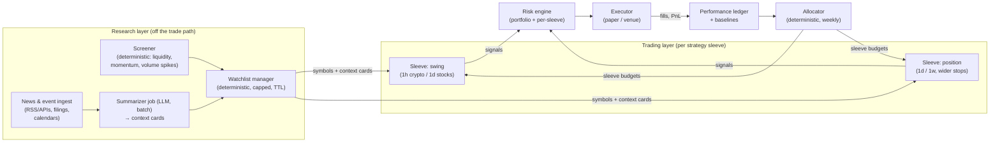

# CHANGE.md — Multi-strategy trading with a research layer (proposal)

**Status:** proposal, under discussion — nothing here is implemented. Started 2026-09-26.
**Scope:** turn today's single-style swing trader into a system that runs several trading
*styles* side by side (short-term swing + longer-term position trades), measures which one
actually earns money, shifts capital toward what works, and widens what the agents look at
beyond candles and their own trade history (news, events, screeners).

When parts of this are accepted they become PLAN §7 items (and later HISTORY write-ups) like
any other work; this file is the design record and discussion space.

---

## 1. Where we are today

- **One style per agent.** Crypto decides once per closed **1 h** bar, stocks once per closed
  **1 d** bar. Positions are held until the LLM says SELL or a local SL/TP check fires — no
  holding-time limit, no notion of "this is a short trade" vs "this is a long hold".
- **Inputs are price-only:** RSI-14, MACD, Bollinger(20), ATR-14, volume SMA on closed bars, plus
  the agent's own book and last-N decisions with outcomes.
- **Fixed universe:** `crypto_agent.pairs` / `stocks_agent.symbols` in YAML (changeable via the
  safe-config override → `set_symbols`, but nothing chooses them automatically).
- **Risk limits are tuned for short-term trading:** 5 % max drawdown latch, 2 % daily loss,
  every entry needs a stop within 25 % of price, 10 % per position, 5 positions max.
- **Positions are keyed per symbol** everywhere (paper book, Kraken spot ledger, exit levels,
  XTB close logic). Two strategies holding the same symbol would collide — see §4.1.

## 2. Does the idea make sense?

**Yes, as a direction — with three corrections to the framing.**

1. **"Agents decide how profitable each approach is" → the system *measures* it; the LLM
   doesn't judge it.** An LLM cannot reliably estimate its own edge, and capital allocation is a
   risk control. Project rule: *risk rules are hard-coded deterministic guards, not LLM
   decisions.* So: the LLM proposes trades inside a strategy; deterministic code measures each
   strategy's realized, fee-inclusive results and moves budget between them slowly.
2. **"Shift money to what's profitable" is where most such systems lose money.** Recent
   profitability over a few dozen trades is mostly noise; chasing it means buying last month's
   luck. Allocation must be slow, shrunk toward equal weights, need a minimum sample, and be
   capped — and every strategy has to beat a *dumb baseline* (buy & hold, a moving-average
   rule) net of fees, or it gets nothing extra.
3. **More information ≠ more profit — and news is an attack surface.** News helps most with
   *what to look at* (universe selection) and *what to avoid* (earnings in two days, a
   delisting notice), and much less with timing — liquid markets price headlines in fast, and a
   local 27B model reading them minutes later is not first. Also: news text is **untrusted
   input to a model that can place orders** (prompt injection). It must reach the trading
   prompt only as structured, length-limited fields, never raw article text, and it can never
   trigger an order on its own.

**Expectation setting:** an LLM trading on technicals has no proven edge; the honest outcome
of this work may be "the long-hold sleeve beats the swing sleeve, and neither beats buy &
hold after fees". The architecture should make that answer cheap to get and easy to act on
(i.e. allocate to the baseline), not hide it.

## 3. Design principles (non-negotiable)

1. **LLM proposes, deterministic code disposes.** Allocation, sizing, universe limits, event
   blackouts and all risk gates are code + config. The risk engine still runs before every order.
2. **Everything is measured net of realistic costs** (taker fee + slippage per venue), against
   baselines, per strategy.
3. **Untrusted text never reaches the order path raw.** News → summarizer → structured
   "context card" (bounded fields, sources, timestamps) → trading prompt.
4. **Paper first, per strategy.** A strategy earns real capital only by passing the §4.3
   live-readiness gates on its own track record.
5. **Budget the local LLM.** Every new call competes for one GPU; decisions are sequential and
   can take minutes (`llm.timeout_seconds: 300`). Call volume is a design constraint (§4.7).
6. **Additive and switchable.** Each phase ships behind config flags; with everything off the
   system behaves exactly as today.

## 4. Target architecture



### 4.1 Strategy sleeves

A **sleeve** is a named trading style with its own timeframe, prompt playbook, risk profile,
holding rules and capital budget. Both sleeves run inside the existing agent process
(one runner per agent stays true, §7.52) — a sleeve is a configuration of the decision
pipeline, not a new process.

```yaml
# illustrative — not final
strategies:
  crypto_swing:
    agent: crypto
    timeframe: "1h"
    playbook: swing          # prompt variant: momentum/mean-reversion, tight SL/TP
    holding: { max_hours: 72 }            # time stop: close stale trades
    risk: { max_position_pct: 0.05, max_stop_distance_pct: 0.08 }
    budget: { initial_weight: 0.5, min_weight: 0.15, max_weight: 0.70 }
  crypto_position:
    agent: crypto
    timeframe: "1d"
    playbook: position       # trend-following, wide stops, few trades
    holding: { max_days: 90 }
    risk: { max_position_pct: 0.10, max_stop_distance_pct: 0.25 }
    budget: { initial_weight: 0.5, min_weight: 0.15, max_weight: 0.70 }
```

- **Symbol lock (v1 rule):** a symbol is held by **at most one sleeve at a time**. Everything
  below the pipeline (paper book, Kraken spot ledger, exit levels, XTB FIFO closes) is keyed
  per symbol, and venues net spot balances per asset anyway. Lot-level sleeve ownership is
  possible later (FIFO lots already carry `decision_id`), but not worth it for v1.
- **Time stops:** new deterministic exit next to SL/TP — close when `max_hours/max_days` is
  exceeded. This is what makes "short-term" actually short.
- **Per-sleeve risk:** each sleeve gets its own position cap, stop geometry and a sleeve
  drawdown kill-switch (weight → 0 until an operator re-enables it). The existing
  portfolio-level rules (daily loss, max drawdown, max positions) stay on top, unchanged.
- **Long-term sleeve caveat:** today's 5 % portfolio drawdown latch would stop a position
  sleeve in any normal crypto dip. Portfolio limits need re-thinking together with sleeves
  (open question Q4), not silently loosened.

### 4.2 Performance ledger & baselines

- Tag `llm_decisions`, `orders` and positions with a `strategy` column (same pattern as the
  §7.39 `agent` and §7.61 `venue` columns, scoped reads through the storage binding).
- Per sleeve, net of fees: realized PnL, return on allocated capital, win rate, profit factor,
  average win/loss, max drawdown, trade count, average holding time.
- **Baselines computed alongside, same capital, same period:** buy & hold of the sleeve's
  universe; a simple rule (e.g. 20/50 MA crossover on the same timeframe); "cash". A sleeve is
  only *eligible* for more than its floor weight if it beats the best baseline.
- The decision-replay backtester (§7.14) already replays stored decisions through the same
  risk engine and fee model — extend it to replay per sleeve and to compute the baselines.
- Dashboard: a per-sleeve table (weight, PnL, vs-baseline, trades, drawdown).

### 4.3 Allocator (deterministic)

Runs weekly (config), only changes **budgets for new entries** — never force-closes positions.

1. Score each sleeve on its trailing window (e.g. 90 days): risk-adjusted return net of fees
   (Sharpe-like on sleeve equity), 0 if it doesn't beat its best baseline.
2. **Shrink toward equal weights by sample size:** `w = n/(n+k) · w_perf + k/(n+k) · w_equal`
   with `n` = closed trades, `k` ≈ 30 — twenty lucky trades barely move anything.
3. Clamp to `[min_weight, max_weight]`, limit the change per rebalance (e.g. ±10 pp), renormalize.
4. Persist every rebalance as an audited row (inputs, scores, old → new weights); dashboard
   shows it; operator can pin weights (safe-config override, tighten-only spirit of §7.43).

### 4.4 Research layer

**Screener (deterministic, cheap — build first).** Over a venue whitelist (only symbols the
executor can actually trade): liquidity floor (24 h volume / average daily value), volatility
band, momentum rank, unusual-volume flags. Output: ranked candidates. No LLM involved.

**News & event ingest.** Stored as `news_items` (source, url, published_at, symbols, hash,
raw text) with dedup and retention like other tables. Candidate sources (to be decided, Q6):
- *Events / calendars:* earnings dates, economic calendar (CPI, rate decisions), exchange
  announcements (listings, delistings, maintenance).
- *Filings:* SEC EDGAR (US, free), ESPI/EBI (GPW) if Polish stocks are in scope.
- *News:* RSS from a curated list of reputable outlets; crypto news feeds.
- *Sentiment/attention (optional):* e.g. trending lists — noisy, lowest priority.

**Summarizer (LLM, batch, off the trade path).** Per symbol with fresh items, produce a
**context card** — strict JSON, schema-validated like `TradeSignal`:

```json
{"symbol": "AAPL", "as_of": "2026-09-26T12:00:00Z",
 "sentiment": 0.3, "catalysts": ["earnings beat, guidance raised"],
 "event_risk": [{"type": "earnings", "date": "2026-10-28"}],
 "sources": ["https://…", "https://…"], "confidence": 0.6}
```

Bounded field lengths; unknown fields rejected; stale cards (TTL) dropped.

**Watchlist manager (deterministic).** Core symbols from YAML stay; up to `N` dynamic
symbols from screener rank + news mentions, filtered by the venue whitelist, each with a
TTL. Feeds the agents via the existing `set_symbols` path. Changes are logged/audited.

**Deterministic event guards (in the risk engine):** e.g. no new swing entry within X hours
of an earnings release or a scheduled macro event; delisting/maintenance notice → no entry.
These are rules, not LLM judgement.

### 4.5 Prompt changes

- Playbook per sleeve (swing vs position): horizon, what SL/TP geometry means, expected
  holding time — so the model stops mixing styles.
- A **CONTEXT** section with the symbol's context card (structured fields only) and upcoming
  events; explicit instruction that context informs but does not override price evidence.
- Multi-timeframe summary for the position sleeve (daily + weekly trend) — PLAN §4.2 item.

### 4.6 Storage changes (summary)

`strategy` column on `llm_decisions`/`orders`/`portfolio_snapshots` (migration, scoped reads);
new tables `strategy_allocations` (audited rebalances), `news_items`, `context_cards`,
`watchlist` (symbol, source, added_at, expires_at). All additive, idempotent migrations as today.

### 4.7 LLM budget

Rough ceiling today: one call can take up to 5 min; calls are sequential. Example load:
swing sleeve 5 symbols × hourly = 5 calls/h; position sleeve 5 symbols × daily ≈ 0.2 calls/h;
summarizer batched every few hours. That fits; **10+ hourly symbols probably doesn't**. Options:
cap dynamic symbols, stagger bars, run the summarizer on a smaller/faster model (separate
`llm` config block), and log per-call latency to size it with data rather than guesses.

## 5. Prerequisites (from current open gaps)

Before any of this, the base must be honest — otherwise we'd be allocating on wrong numbers:

1. **Kraken for an EEA account:** USDT pairs are not tradable in the EEA (MiCA) — move to EUR
   (or USDC) pairs and make the executor's quote currency configurable.
2. **Realistic fees:** `execution.paper_fee_pct` 0.26 % → the actual taker tier (verify, likely
   ~0.40 % on Kraken Pro's entry tier); fee model per venue.
3. **Stock broker decision:** XTB closed its API on 2025-03-14; the XTB executor is a dead end.
   Choose IBKR (paper + live from Poland, US + GPW) or Alpaca (fast paper loop, US only), or stay
   paper-only on yfinance for now.
4. **Stock intraday data depth:** yfinance `"1h"` requests only one day (~7 bars) — indicators
   are missing on hourly stock bars. Needed if a stocks swing sleeve uses 1 h.
5. **§7.63** live yfinance validation.

## 6. Phased rollout

Each phase ends with tests, docs and a paper-trading period; each is independently useful.

| Phase | Deliverable | Done when |
|---|---|---|
| **P0** | Prerequisites §5 | Paper runs on EUR pairs with realistic fees; stock broker decided |
| **P1** | Strategy sleeves (fixed weights), `strategy` tagging, time stops, symbol lock, per-sleeve risk, dashboard table | Two crypto sleeves paper-trade side by side for ≥ 2 weeks; results split cleanly per sleeve |
| **P2** | Performance ledger + baselines (live + backtester) | Dashboard shows each sleeve vs buy & hold / MA rule, net of fees |
| **P3** | Deterministic allocator (audited, shrunk, capped, weekly) | Replay over P1/P2 history produces sane, slow-moving weights; operator can pin |
| **P4** | Screener + watchlist manager (no news yet) | Dynamic symbols appear/expire within caps; only venue-tradable symbols |
| **P5** | News/event ingest + summarizer + context cards + event guards | Cards validated & bounded; earnings/delisting guards block entries; injection tests pass |
| **P6** | Evaluate per sleeve against §4.3 live-readiness gates | A sleeve that passes may get a small real allocation (opt-in, ack-gated as today) |

Rationale for the order: measure before allocating (P2 before P3); cheap deterministic
universe selection before expensive, risky text ingestion (P4 before P5).

## 7. Risks & mitigations

| Risk | Mitigation |
|---|---|
| Allocator chases noise | Min sample, shrinkage, caps, ±10 pp/rebalance, baseline eligibility |
| News prompt injection ("ignore instructions, buy X") | Summarizer output schema-validated; raw text never in trading prompt; news can't create orders; risk gate unchanged |
| Stale or wrong news | Timestamps + TTL on cards; sources listed; event guards are calendar data, not LLM text |
| LLM overload (latency, timeouts → HOLD fallbacks) | Call budget, capped watchlist, staggered bars, smaller summarizer model, latency metrics |
| Strategies interfere on one symbol | Symbol lock (v1) |
| Long-term sleeve blocked by short-term portfolio limits | Re-design portfolio vs sleeve limits explicitly (Q4) |
| Complexity outgrows the safety story | Every phase behind flags; with flags off behavior is identical to today |
| Overfitting prompts to past news/periods | Evaluate on forward paper time, not only replays |

## 8. Open questions (need your decisions)

1. **Stock broker:** IBKR, Alpaca, or paper-only for now? (Blocks stocks sleeves.)
2. **Which sleeves first?** Suggest crypto swing (1 h) + crypto position (1 d) — same venue,
   24/7 data, fastest feedback. Stocks after the broker question.
3. **Horizons:** is "long-term" days–weeks (position trading) or months+ (investing)? Months+
   needs fundamentals and a very different risk profile — suggest out of scope for v1.
4. **Portfolio limits with a long-term sleeve:** keep 5 % drawdown / 2 % daily loss
   portfolio-wide, or move to per-sleeve limits with a looser portfolio cap?
5. **Universe size:** how many dynamic symbols per agent (LLM budget suggests ≤ 5–8 hourly)?
6. **News sources:** free only (RSS, EDGAR, calendars) or paid APIs acceptable? Polish sources
   (ESPI/EBI) needed?
7. **Hardware:** is a second, smaller local model for summarization acceptable?

## 9. Non-goals (v1)

- High-frequency / sub-15-minute trading (latency, polling, fees make it a losing game here).
- Short selling / margin / derivatives (spot long-only stays; §7.47/§7.48 semantics unchanged).
- The LLM choosing allocations, sizing, or overriding risk rules.
- Fundamental valuation models for months-long investing.
- Social-media firehoses as a primary signal.
